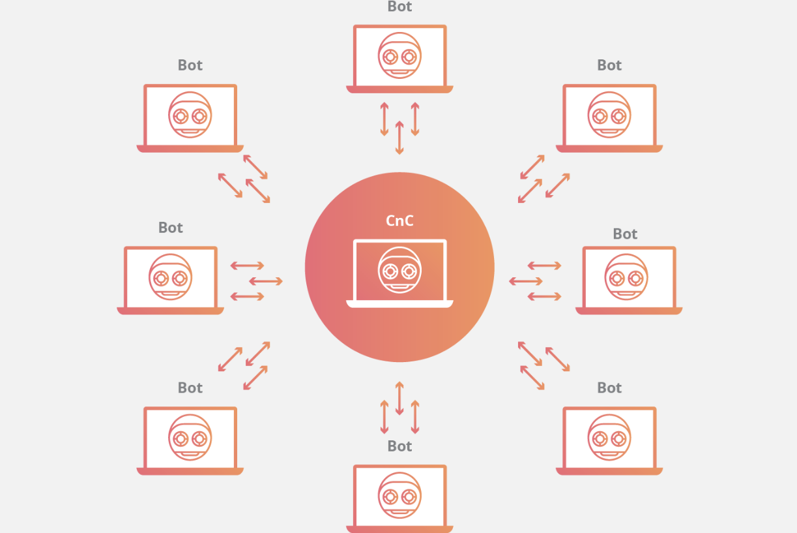
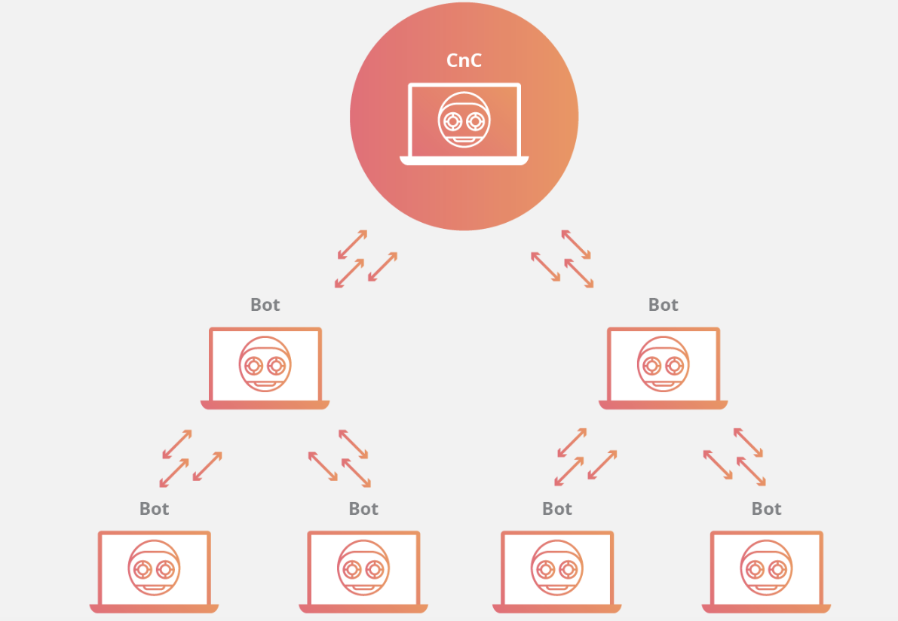
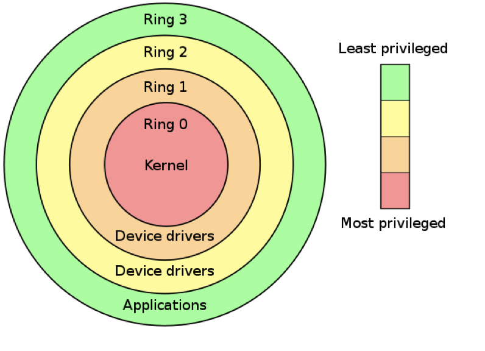
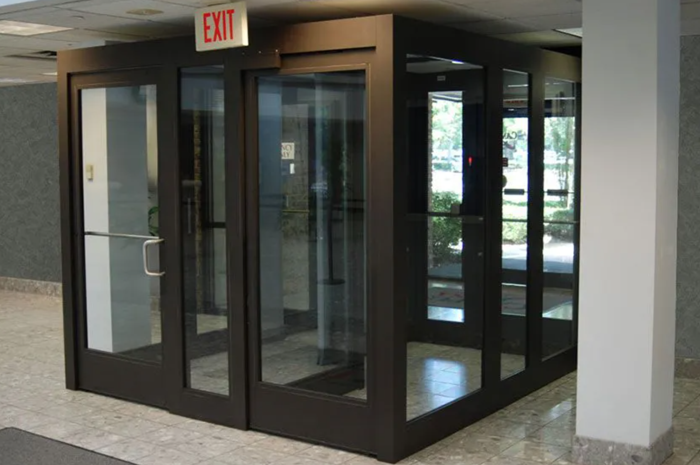

# Assignment 01: Week 01

Before attempting this assignment, please make sure you have completed all of the material in the lessons tab.

Create a copy of this google document [lastname_A01](https://docs.google.com/document/d/1l1_e2PH_GEqomQkyeASfAKpCOK6E0cmMa8tn_UMsgmM/edit?usp=sharing) (File > Make a Copy) to record all of your assignment answers in.

> :warning: Failure to use answer document properly will result in a 10pt deduction from final score.

The table of contents for this lab is found below.

&nbsp;&nbsp;&nbsp;&nbsp;&nbsp;&nbsp; Part 1: Overview of Malware  
&nbsp;&nbsp;&nbsp;&nbsp;&nbsp;&nbsp; Part 2: Overview of Attack Types  
&nbsp;&nbsp;&nbsp;&nbsp;&nbsp;&nbsp; Part 3: Submission  

## Part 1: Overview of Malware

:interrobang: Question 1 - In your own words, describe each of the below malware types (objective/goal and how they work (in general)):

<table border="0">
 <tr>
    <td><b style="font-size:30px"></b></td>
    <td><b style="font-size:30px"></b></td>
 </tr>
 <tr>
    <td>Virus   Worm   Crypto-malware   Ransomware   Trojan   RAT   Backdoor </td>
    <td>Rootkit   Keylogger   Adware   Spyware   Bots and Botnets    Logic Bomb </td>
 </tr>
</table>

:interrobang: Question 2 - Describe some of the different strategies we can implement to combat malware.  

:interrobang: Question 3 - What makes a logic bomb difficult to detect? How can we protect against logic bombs?  

:interrobang: Question 4 - List some of the reasons threat actors want to infect our systems with malware.  

:interrobang: Question 5 - What is one of the *best* ways to protect yourself against ransomware or crypto-malware attacks?  

:interrobang: Question 6 - CnC is botnet jargon for `___________`.  

Botnets can take different command topologies. Label two different styles of bot-net based on their structures below.  

* Hierarchical Network Topology
* Star Network Topology

:interrobang: Question 8 - Image A = `_______`.  

:interrobang: Question 9 - Image B = `_______`.  

| Image A             |  Image B |
:-------------------------:|:-------------------------:
  |  

:interrobang: Question 10 - How does the below image illustrates why rootkits are exceeding difficult to detect and remove? Which privilege level do rootkits usually infect?  

## Part 2: Overview of Attack Types 

:interrobang: Question 11 - In your own words, describe each of the below attack types (objective/goal and how they work (in general)):

<table border="0">
 <tr>
    <td><b style="font-size:30px"></b></td>
    <td><b style="font-size:30px"></b></td>
 </tr>
 <tr>
    <td> Phishing   Spearfishing   Crypto-malware  </td>
    <td> Tailgating   Impersonation </td>
 </tr>
</table>

:interrobang: Question 12 - Describe some of the different strategies we can implement to combat some of these attacks.  

:interrobang: Question 13 - What physical security is depicted below. What does this physical security seek to  prevent?  

:interrobang: Question 14 - Describe how a mantrap/airtrap door works.  

:interrobang: Question 15 - List some of the tactics an impersonator might use?  

:interrobang: Question 16 - Where are most physical security measures implemented?  

:interrobang: Question 17 - It's important that every member of an organization is constantly looking for some form of `______`.  

:interrobang: Question 18 - If an employee notices someone that they don't recognize not displaying proper identification, what should they do? What should they do if they are uncomfortable directly confronting that individual? 

## Part 3: Submission

Export your answer document to a .PDF and upload a single `lastname_A01.pdf` answer document containing all of your answers to the lab questions to Brightspace through the attachment uploads option.
