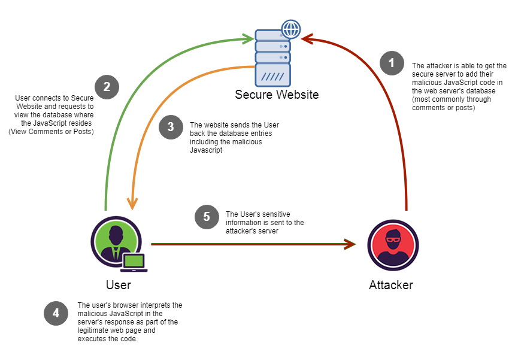
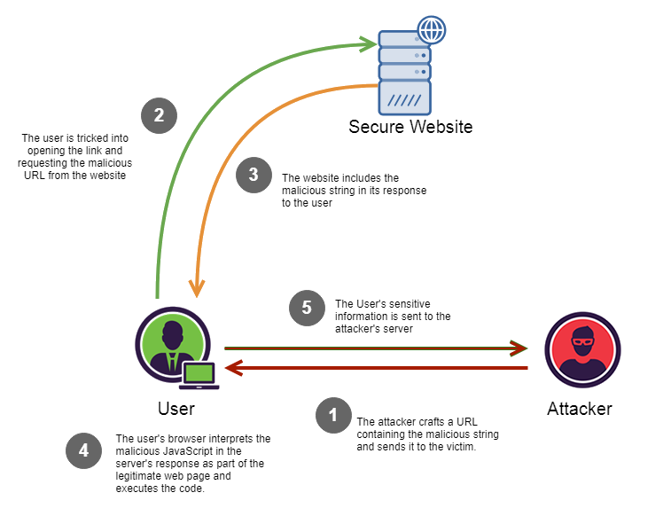

# Assignment 02: Attacks

Before attempting this assignment, please make sure you have completed all of the material in this weeks lessons.

Create a copy of this google document [lastname_A02](https://docs.google.com/document/d/1HCCFf5WNqMj6MFo7lqXyPScpJrUtqEm644ZUoouPZgE/edit?usp=sharing) (File > Make a Copy) to record all of your assignment answers in.

Ensure your answer file has the following format:

The table of contents for this assignment is found below.

Part 1: Cyber and Physical Attack Types  
Part 2: Submission  

## Part 1. Cyber and Physical Attack Types

:interrobang: Question 1 - In your own words, describe each of the below attack types (objective/goal and how they work (in general)):

<table border="0">
 <tr>
    <td><b style="font-size:30px"></b></td>
    <td><b style="font-size:30px"></b></td>
 </tr>
 <tr>
    <td>Phishing   Impersonation   Dumpster Diving </td>
    <td>Shoulder Surfing   Hoax   Watering Hole Attack </td>
 </tr>
</table>

:interrobang: Question 2 - Describe each of the common tactics that social engineers use to get what they want?  

:interrobang: Question 3 - What are some of the common factors that cause people to fall for social engineering attacks?  

:interrobang: Question 4 - What would you consider to be a good defense against social engineering? 

:interrobang: Question 5 - What are the key differences between Phishing, Whaling, Spear Phishing, and Vishing?  

:interrobang: Question 6 - Explain how impersonation and phishing overlap.  

:interrobang: Question 7 - What type of attack does the below graphic represent?  

:interrobang: Question 8 - What type of attack does the below graphic represent?  

:interrobang: Question 9 - What is the difference between a persistent and non-persistent XSS attacks?  

:interrobang: Question 10 - What is the general approach used in injection attacks?  

:interrobang: Question 11 - How can injection attacks be prevented?  

:interrobang: Question 12 - Analyze [this](https://www.youtube.com/watch?v=PWVN3Rq4gzw) clip showing a successfully social engineering attack. Describe all of the technical and non-technical techniques used that made it a successful attack.  

:interrobang: Question 13 - Analyze [this](https://www.youtube.com/watch?v=xuYoMs6CLEw) clip showing another successfully social engineering attack. Describe all of the technical and non-technical techniques used that made it a successful attack (different clip than q12).  

## Part 2. Submission

Upload a single `lastname_a2.pdf` containing all of your answers to the assignment questions to Sakai through the attachment uploads option.
