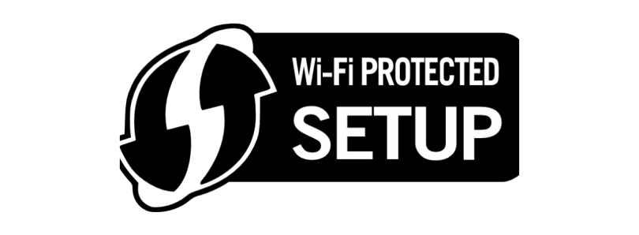
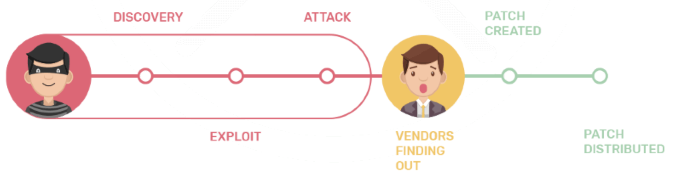

# Assignment 03: Cyber Attacks (cont.)

Before attempting this assignment, please make sure you have completed all of the material in this weeks lessons.

Create a copy of this google document [lastname_A03](https://docs.google.com/document/d/1lyZrRlL8yveVshaKXLyR_cdOKFqGyxqnD-s0kxRxQEM/edit?usp=sharing) (File > Make a Copy) to record all of your assignment answers in.

Ensure your answer file has the following format:

The table of contents for this assignment is found below.

Part 1: Cyber Attack Types  
Part 2: Submission  

## Part 1. Cyber and Physical Attack Types

:interrobang: Question 1 - In your own words, describe each of the below attack types (objective/goal and how they work (in general)). Please provide protection strategies against these attacks in your response:

<table border="0">
 <tr>
    <td><b style="font-size:30px"></b></td>
    <td><b style="font-size:30px"></b></td>
 </tr>
 <tr>
    <td>Privilege Escalation   DNS Poisoning   Domain Hijacking   Zero-day   Client Hijacking   Evil Twins </td>
    <td>Driver Manipulation   Spoofing   Wireless Replay   Rogue Access Points   Wireless Jamming   WPS Attacks</td>
 </tr>
</table>

It's important to recognize that many of these attacks can be used together to devastate a system. A RAT can be used to install a backdoor, allowing for a threat actor to pivot, escalate their privilege level and then poison your DNS server to send you to a spoofed website to capture your credentials. These attacks will usually work together to achieve a specific goal.  Thinking about how these attacks work together and what we can do to interrupt them is an important part of cyber defense.

:interrobang: Question 2 - Compare and contrast DNS Poisoning and Domain Hijacking.  

:interrobang: Question 3 - What general security advice would your give a new company looking to start a cyber security/malware defense program? Justify your suggestions / claims.  

:interrobang: Question 4 - According to the book what percentage of attacks are from buffer overflow?  

:interrobang: Question 5 - Provide an example of typo-squatting.  

:interrobang: Question 6 - Why are rogue AP's a clever way to deliver a man in the middle attack?  

:interrobang: Question 7 - What are the advantages of performing a password or WPS IV crack "offline"?  

:interrobang: Question 8 - Describe the security concerns associated with the below logo:  

:interrobang: Question 9 - What is click-hijacking?  

:interrobang: Question 10 - Assume you connect to an evil twin SSID. What security measure would protect you from threat actors collecting your sensitive network traffic?  

:interrobang: Question 11 - What is horizontal privilege escalation? What type of concerns does it pose (security, privacy, both) and why?  

:interrobang: Question 12 - Why would a threat actor choose to infect a computers driver?  

:interrobang: Question 13 - Why is signature based detection largely ineffective against polymorphic and metamorphic malware?  

:interrobang: Question 14 - What cyber attack cycle is illustrated in the below timeline:  

## Part 2. Submission

Upload a single `lastname_a3.pdf` containing all of your answers to the assignment questions to Sakai through the attachment uploads option.
