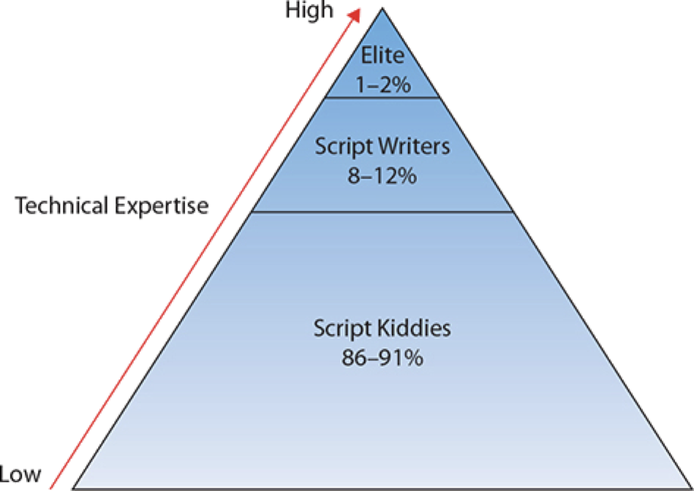

# Assignment 04: Week 04 Review

Before attempting this assignment, please make sure you have completed all of the material in this weeks lessons.

Create a copy of this google document [lastname_A04](https://docs.google.com/document/d/1rdNCNoqlO0nn9LFM4PMxYaEez4ADyVYtBIQMj-fJbY0/edit?usp=sharing) (File > Make a Copy) to record all of your assignment answers in.

Ensure your answer file has the following format:

The table of contents for this assignment is found below.

Part 1: Cyber Attacks and Threat Actors 
Part 2: Penetration Testing  
Part 3: Vulnerability Scanning  
Part 4: Vulnerability Types  
Part 5: Submission  

## Part 1. Cyber Attacks

:interrobang: Question 0 - In your own words, describe each of the below attack types (objective/goal and how they work (in general)). Please provide protection strategies against these attacks in your response:  

<table border="0">
 <tr>
    <td><b style="font-size:30px"></b></td>
    <td><b style="font-size:30px"></b></td>
 </tr>
 <tr>
    <td> Bluejacking   Bluesnarfing   RFID and NFC Attack   Wireless Disassociation   Known Plaintext Attack </td>
    <td> Rainbow Table Attack   Dictionary Attacks   Brute Force Attack   Birthday Attack   Downgrade Attack</td>
 </tr>
</table>

:interrobang: Question 1 - What is the difference between RFID and NFC?  

:interrobang: Question 2 - What is a salted hash?  

:interrobang: Question 3 - What is a collision?  

:interrobang: Question 4 - What does the below symbol indicate?  

:interrobang: Question 5 - Special properties do hashes have that make them useful for file validation?  

:interrobang: Question 6 - What is the formal definition of a threat actor?  

:interrobang: Question 7 - *In your own words*, define the following terms.

   * Script Kiddies
   * Hacktivists
   * Organized Crime
   * Nation States/APT
   * Insiders
   * Competitors

:interrobang:Question 8 - Compare and contrast internal and external threat actors.  

:interrobang:Question 9 - Analyze how the level of sophistication of a threat actor contributes to the nature of the attack. Use the figure below to support your analysis.  

## Part 2. Penetration Testing

:interrobang: Question 10 - What is a penetration test?  

:interrobang: Question 11 - Compare and contrast passive reconnaissance and active reconnaissance.  

:interrobang: Question 12 - Describe the general process used by both pen-testers and threat actors when delivering an exploit.  

:interrobang: Question 13 - Would open source intelligence be considered as passive or active reconnaissance. Why?  

:interrobang: Question 14 - What are the differences between Black Box, White Box, and Grey Box pen-testing?  

## Part 3. Vulnerability Scanning

:interrobang: Question 15 - What is a vulnerability?  

:interrobang: Question 16 - Compare and contrast Intrusive and Non-Intrusive vulnerability scans.  

:interrobang: Question 17 - What is a false positive?  

:interrobang: Question 18 - What is a false negative?  

:interrobang: Question 19 - What poses a higher risk to a system, a false positive or false negative?  

:interrobang: Question 20 - Why can false positives be dangerous for organizations?  

:interrobang: Question 21 - How is vulnerability scanning different from penetration testing?  

## Part 4. Vulnerability Types

:interrobang: Question 22 - In your own words, describe each of the below vulnerability types (how they work (in general)). Please provide protection strategies against these vulnerabilities in your response:  

<table border="0">
 <tr>
    <td><b style="font-size:30px"></b></td>
 </tr>
 <tr>
    <td> Race condition   End-of-life   Lack of vendor support   Improper input handling   Misconfiguration</td>
   
 </tr>
</table>

## Part 5. Submission

Upload a single `lastname_a4.pdf` containing all of your answers to the assignment questions to Sakai through the attachment uploads option.
