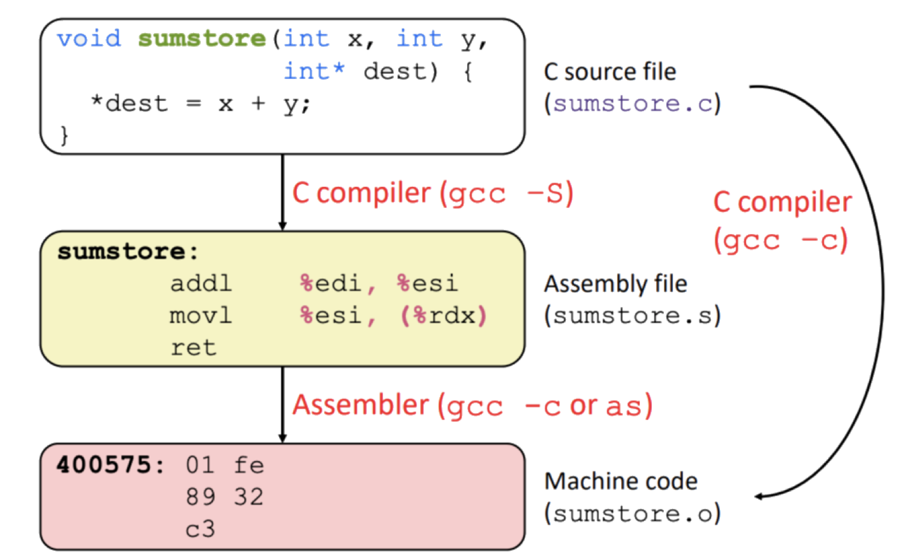

# Assignment 08: Week 08 Review

Before attempting this assignment, please make sure you have completed all of the material in this weeks lessons.

Create a copy of this google document [lastname_A08](https://docs.google.com/document/d/1QkmTweiaSzWXqtvvw11SxE7pNvyrB1rtIgcTT9OlLkk/edit?usp=sharing) (File > Make a Copy) to record all of your assignment answers in.

Ensure your answer file has the following format:

The table of contents for this assignment is found below.

Part 1: Development Life-Cycle Models, Secure DevOps, Version Control and Change Management  
Part 2: Provisioning, Secure Coding Techniques, Code reuse, Code Quality and Testing  
Part 3: Cloud, Cloud Deployment Models, Cloud Security, Virtualization, Virtualization Security  
Part 4: Resiliency, Automation, Redundancy, Fault Tolerance, High Availability, Physical Security Controls 
Part 5: Submission  

## Part 1: Development Life-Cycle Models, Secure DevOps, Version Control and Change Management

:interrobang: Question 1 - Compare and contrast the waterfall and agile software development paradigms.  

:interrobang: Question 2 - In your own works, how would you define Secure DevOps?  

:interrobang: Question 3 - Define continuous integration in the context of Secure DevOps.  

:interrobang: Question 4 - What is an immutable system and what security benefits can be recognized when using one instead of a mutable  systems?  

:interrobang: Question 5 - Define Infrastructure as Code (IAC).  

:interrobang: Question 6 - Define version control and describe why it's an important part of the software development process.  

:interrobang: Question 7 - How do version control and change control differ?  

## Part 2: Provisioning, Secure Coding Techniques, Code reuse, Code Quality and Testing

:interrobang: Question 8 - How are provisioning and deprovision used when designing and deploying networks?  

:interrobang: Question 9 - How can improper error and exception handling result in the unauthorized disclosure of source code? What can be done to mitigate this disclosure? 

:interrobang: Question 10 - Define input normalization.  

:interrobang: Question 11 - What do stored procedures prevent?  

:interrobang: Question 12 - Should data at rest be encrypted or data in-transit be encrypted?  

:interrobang: Question 13 - What is data obfuscation?  

:interrobang: Question 14 - What security concerns exist when using pre-defined code functions/libraries?   

:interrobang: Question 15 - Define dead code.  

:interrobang: Question 16 - Why should we validate inputs and authentication decisions on server-side instead of client-side? 

:interrobang: Question 17 - Data leaks are a result of poor `______` ?  

:interrobang: Question 18 - What is the difference between static and dynamic code analysis?  

:interrobang: Question 19 - What type of information can stress testing code provide?  

:interrobang: Question 20 - Compare and contrast compiled vs runtime code  

:interrobang: Question 21 - What is the below image depicting? Describe what is happening in detail.  

## Part 3: Cloud, Cloud Deployment Models, Cloud Security, Virtualization, Virtualization Security

:interrobang: Question 22 - Define virtualization.  

:interrobang: Question 23 - How does a type I hypervisor differ from a type II hypervisor? Which one is quicker? 

:interrobang: Question 24 - What are some good strategies to avoid VM sprawl?  

:interrobang: Question 25 - Describe the below cloud deployment models:  

* PaaS
* Saas
* Iaas
* PaaS

:interrobang: Question 26 - What is SECaas?  

:interrobang: Question 27 - Why is VDI so secure for an organization and it's employees?  

## Part 4: Resiliency, Automation, Redundancy, Fault Tolerance, High Availability, Physical Security Controls

:interrobang: Question 28 - What are VM templates?  

:interrobang: Question 29 - Why should you advocate for having a master image of your organizations infrastructure? How can a master image impact overall system/network availability?  

:interrobang: Question 30 - A deep freeze of a system is an instance of `______` 

:interrobang: Question 31 - What are some differences between elasticity and scalability?  

:interrobang: Question 32 - How does redundancy improve fault tolerance?  

:interrobang: Question 33 - Name a real world system that *must* have high availability. This is, it should be always on, and always available. What would happen if that system was down, even for only a short time?  

:interrobang: Question 34 -  Name some of the strategies that we can implement to have redundancy and fault tolerance features on our network or infrastructure.  

:interrobang: Question 35 - Describe the physical security controls listed below. For each control, discuss how it contributes to the overall security of an organization:  

<table border="0">
 <tr>
    <td><b style="font-size:30px"></b></td>
    <td><b style="font-size:30px"></b></td>
    <td><b style="font-size:30px"></b></td>
 </tr>
 <tr>
    <td> Lighting   Signs   Remote Wipe   Fencing   Rack monitoring   Air gaps   Cable locks </td>
    <td> Security Guards   Access lists   Alarms   Safes   Protected distribution enclosure   Mantraps   Fire suppression system   Cryptographic key management tools </td>
    <td> Faraday cages   Door access controls   Advanced biometrics   Bollards   Access token/cards   HVACs   Screen filters   Logs </td>
 </tr>
</table>

## Part 5. Submission

Upload a single `lastname_a8.pdf` containing all of your answers to the assignment questions to Brightspace through the attachment uploads option.
