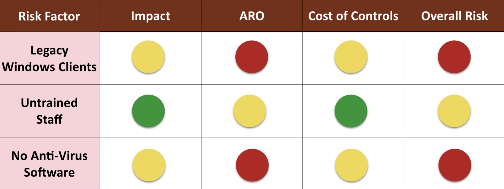

# Assignment 10: Week 10 Review Questions

Before attempting this assignment, please make sure you have completed all of the material in this weeks lessons.

Create a copy of this google document [lastname_A10](https://docs.google.com/document/d/1ieBkCXlGcuLM-0ZKB2f35SJrqaiXZ-kHYWHflwj0PEc/edit?usp=sharing) (File > Make a Copy) to record all of your assignment answers in.

Ensure your answer file has the following format:

The table of contents for this assignment is found below.

Part 1: Agreement Types, Personnel Management, Role-based Awareness Training, General Security Policies  
Part 2: Business Impact Analysis, Risk Assessment, Incident Response Planning, Incident Response Process  
Part 3: Gathering Forensics Data, Using Forensics Data  
Part 4: Submission  

## Part 1: Agreement Types, Personnel Management, Role-based Awareness Training, General Security Policies 

:interrobang: Question 1 - What are standard operating procedures?  

:interrobang: Question 2 - What are interoperability agreements used for? 

:interrobang: Question 3 - List and define the common agreement types we discussed this week.  

:interrobang: Question 4 - How do mandatory vacations and job rotations contribute to security?  

:interrobang: Question 5 - Compare and contrast separation of duties and dual control different?  

:interrobang: Question 6 - Why should you employees sign an AUP? Can AUPs be cited as grounds for termination?  

:interrobang: Question 7 - What is the purpose of role-based awareness training?  

:interrobang: Question 8 - List some of the different roles a user can have at an organization.  

:interrobang: Question 9 - Why should organizations keep a close eye on employee use of social media and personal email use on corporate networks/systems?  

## Part 2: Business Impact Analysis, Risk Assessment, Incident Response Planning, Incident Response Process

:interrobang: Question 10 - Define MTTR, MTTF, MTBF, RTO and RPO  

:interrobang: Question 11 -  How can the definition of availability affect the availability/annual downtime value that you report at the end of the year?  

:interrobang: Question 12 - What is a strong defense against single points of failure?  

:interrobang: Question 13 -  When conducting a business impact analysis for an organization, what are potential elements that can be impacted if a security event occurs?  

:interrobang: Question 14 - Staying within compliance with privacy laws is important. How figures can we calculate to determine how much privacy is required for the data that we hold and the assessment of your privacy standards?  

:interrobang: Question 15 -  Describe the two threats that we should consider with thinking about organization risk.  

:interrobang: Question 16 - What do the ARO, SLE, and AEL tell us about risk?  

:interrobang: Question 17 - How do quantitative and qualitative risk differ?  

:interrobang: Question 18 -  Which type of risk does the below figure visualize?  

:interrobang: Question 19 - What response techniques can organizations use to deal with risk?  

:interrobang: Question 20 - How can change introduce new risk? When changes are made at an organization, what should be done to manage the potential risk that comes with change?  

:interrobang: Question 21 - Define the terms security incident and incident response.  

:interrobang: Question 22 - How does classifying and responding to incidents based on it's classification improve reaction time to security incidents?   

:interrobang: Question 23 - What is an incident response team?  

:interrobang: Question 24 - When a security incident has been detected, who are some parties of interest that should be contacted?   

:interrobang: Question 25 - What is a CIRT?  

:interrobang: Question 26 - When should you evaluate your CIRTs response to a security event?  

:interrobang: Question 27 - Describe some ways that you should prepare your organization for an security incident.
 

:interrobang: Question 28 - The beginning signals of a security incident are referred to as `________`.  

:interrobang: Question 29 - When we discover an active threat, we want to `_________` as quickly as possible.  

:interrobang: Question 30 - Once contained, the `_______` process can begin.  

:interrobang: Question 31 - Once back to nominal operation, it's important to all of those involved in the incident to `________`.  

## Part 3: Gathering Forensics Data, Using Forensics Data

:interrobang: Question 32 - Define the term `Order of volatility` in digital forensics?  

:interrobang: Question 33 - Define the term `Chain of custody` in digital forensics?  

:interrobang: Question 34 - What is a legal hold?  

:interrobang: Question 35 - When creating a bit-for-bit image of a suspect's hard drive, what tool can be used to prevent any modifications from being made to the suspect drive?   

:interrobang: Question 36 - What are write blockers so important to use in digital forensics?  

:interrobang: Question 37 - How do write blockers relate to hashing evidence?  

:interrobang: Question 38 - What standard digital forensic process is performed by digital forensic experts?  

:interrobang: Question 39 - Generally, can more information be collected during a live acquisition or static acquisition?  

:interrobang: Question 40 -  Why are system types and file stamps important in digital forensics?   

:interrobang: Question 41 -  How is hashing used in digital forensics. Why is it so important?   

:interrobang: Question 42 -  Assume the MD5 hash for a suspect's hard drive that was collected a year ago is different than today than it was during the original time of seizure of that volume. How can the defense team use this to their advantage?   

## Part 4. Submission

Upload a single `lastname_a10.pdf` containing all of your answers to the assignment questions to Brightspace through the attachment uploads option.
