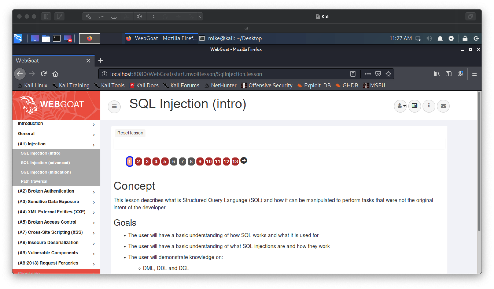
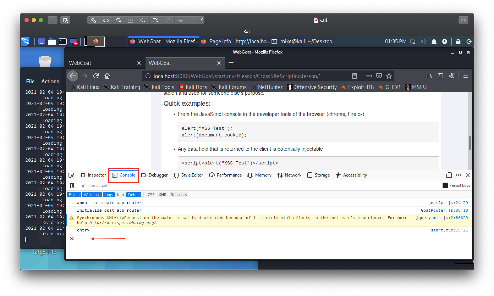

# Lab 02: Injection and Scripting Attacks

Before attempting this lab, please make sure you have completed all of the material in the lessons tab.

The table of contents for this lab is found below.

1. Part 1. Installing WebGoat <br>
2. Part 2. SQL Injection <br>
3. Part 3. Cross-Site Scripting <br>
4. Part 4. Submission <br>

Create a copy of this google document [lastname_lab02](https://docs.google.com/document/d/1-2Fu0TxtctMiYZ0S0s8Yq9gFqxNNa2hyyCudGM-7Jjs/edit?usp=sharing) (File > Make a Copy) to record all of your assignment answers in.

> :warning: Failure to use answer document properly will result in a 10pt deduction from final score.

**Statement of Ethics:** The tools used in this lab can be used to break into vulnerable computer systems. The use of these tools and skills should only be implemented in an ethical, professional and legal manner. By law, you must have the explicit, written consent from the owner of the systems that these tools are targeted against if they are not owned by you.

This week, we took a look at some more advanced type of cyberattacks that you or your organization might face. In this lab, we're going to take a deeper look at injection and cross-site scripting attacks. We'll be attacking a pre-configured and vulnerable web application named WebGoat.

## Part 1 - Installing WebGoat

**Step 1.1** Launch your Kali VM. All of follow steps take place *inside* your Kali environment. 

**Step 1.2** Navigate to [this link](https://github.com/WebGoat/WebGoat/releases) - [File (Right Click > Safe Link As...)](http://dl.dropboxusercontent.com/s/xwgbyg39o3nnct5/webgoat-server-8.1.0.jar?dl=1) to download the most recent version of Webgoat(v8.1.0).

**Step 1.3** When you click on the v8.1.0 release link, you'll see four different download assets (when you scroll down to the bottom of the webpage). Download the `webgoat-server-8.1.0.jar` file.

**Step 1.4** Once downloaded, open a terminal and  navigate to the directory where your WebGoat download is. 

**Step 1.5** Run the below command:

```bash
java -jar webgoat-server-8.1.0.jar
```

**Step 1.6** Launch the Kali Web Browser (Kali Symbol (top left) > Web Browser) and type the below URL in your address bar.

`localhost:8080/WebGoat/login`

:interrobang: Question 1: Describe in a sentence or two what the `localhost:8080` part of the URL means.

:interrobang: Question 2: Submit a screenshot of the WebGoat login landing page.

**Step 1.7** Select *Regester new user* and fill out the registration page.

> :warning: **Please *do not* use any passwords that you use for any other accounts you might have. WebGoat was intentionally designed to have vulnerabilities ~ which is why we are using it inside our VM**

While running this program your machine will be extremely vulnerable to attack. You should disconnect your VM from the Internet while using this program. WebGoat's default configuration binds to localhost to minimize the exposure.

*This program is for educational purposes only.* If you attempt these techniques without authorization, you are very likely to get caught. If you are caught engaging in unauthorized hacking, most companies will fire or pursue legal action you. Claiming that you were doing security research will not work as that is the first thing that all hackers claim.

:interrobang: Question 3: Give a summary of the **Terms of Use** disclosure that you've agreed to in WebGoat.

## Part 2 - SQL Injection

Now that we have our environment set up, let's deliver a basic SQL attack through the WebGoat application.

Select ` A1 Injection ` and then `SQL Injection (intro)`. You'll be presented with a webpage that should look similar to the below image.



The numbers 1 - 13 represent pages with both content and modules related to SQL injection. 

**Step 2.1** Read the content on pages 1 - 3 *without* doing any of the `It is your turn!` activities.

**Step 2.2** Go back to page 2 once you've read pages 1 - 3 and complete the `It is your turn!` activity on page 2.

> Hint: Here, you're creating the SQL query to retrieve the department that Bob Franco belongs to. The name of the table that you are accessing `Employees`. Basic SQL commands to retrieve data from a table follow the below format

```sql
SELECT column_header FROM Table_Name WHERE condition 
```

Page 3 has a good example of a similar problem.

:interrobang: Question 4: What SQL query did you create to get a successful database response?

:interrobang: Question 5: Submit a screenshot of your successful SQL query.

**Step 2.3** Go to page 3 and do the `It is your turn!` activity on page 3.

> Hint: Here, instead of simply accessing values inside of the database, you're looking to manipulate the data inside of the database to change the department that Tobi Barnett belongs to. Basic SQL commands to modify data from a table follow the below format:

```sql
UPDATE column_header SET column='value1' WHERE condition; 
```
:warning: Note: Single quote marks are used to indicate string values in SQL.

:interrobang: Question 6: What SQL query did you create to successfully modify the department field for Tobi?

:interrobang: Question 7: Submit a screenshot of your successful SQL query.

**Step 2.4** Go to page 6 and read through it. Play with the `Username :` field to get a feel of how form input (which is supplied by the user) is passed over to the back end and used to create customized SQL commands that retrieve the data requested by a user. 

The abuse of this user input field is how injection attacks work. If the user input that is captured from those form fields is not sanitized and processed properly, an attack can disrupt the confidentiality, integrity, and availability of sensitive data.

**Step 2.5** Read pages 7 - 9.

**Step 2.6** Complete the SQL injection attack query that retrieves all the users from the users table on page 9.

:interrobang: Question 8: Submit a screenshot of your successful injection SQL attack.

## Part 3 - Cross-Site Scripting

This week, we also discussed how cross-site scripting (XSS) attacks work. It's common for threat actors to probe applications and networks for vulnerabilities. Once a vulnerability is found, it's exploited. Cross-site scripting is something that both website owners and users need to be caution of because most of the time, these attacks go unnoticed.

For this part of the lab, we're going to probe a web application for cross-site scripting vulnerabilities. 

**Step 3.1** Read pages 1 and 2.

**Step 3.2** Run the below JavaScript script in your browser:

```js
alert("XSS Test");
alert(document.cookie);
```

You can access your JavaScript console in the developer tools of the browser (Firefox) by right clicking in your browser window running WebGoat > Inspect Element > Console. At the bottom of your JS console you should see your console prompt `>>`.



:interrobang: Question 8: Submit a screenshot of your XSS alert. <br>

:interrobang: Question 9: Submit a screenshot of your JSession-ID cookie information. <br>

As you know, secure websites and web applications will not allow users to execute out own JavaScript code on their website (like what we just did). It's a trivial matter to randomly check different websites to see if that have this vulnerability in the exact way that we just ran this JS alert. Once this vulnerability is identified, a modified URL that automatically executes a JavaScript script (that does more that a simple alert) can be sent to unsuspecting users. 

This is an example of a non-persistent XSS attack, as the attack is being delivered from the users browser.

Persistent XSS attacks will have the JS script embedded on the client side of this transaction, executing as soon as a user loads the compromised webpage. 


**Step 3.3** Read pages 3 - 7.

**Step 3.4** Determine which field in the shopping cart form is vulnerable to an XSS attack.

:interrobang: Question 10: Submit a screenshot of your successful reflected XSS attack (attack will get blocked by application, but will recognize a successful attack attempt). <br>

Hint: When JavaScript is not included in a website in its own .js file, it can be include in HTML documents through the use of `script` tags as seen below:

```html
<script> //JavaScript code goes here </script>
```

Sandwich your JS between two script tags when testing against forum boxes.

:interrobang: Question 11: Why does successfully running this simple JavaScript program have serious security implications for this shopping application? 

## Part 4. Submission

Convert your answer document in to a **.PDF** and upload a single `lastname_lab2.pdf` answer document containing all of your answers to the assignment questions to Brightspace through the attachment uploads option.
