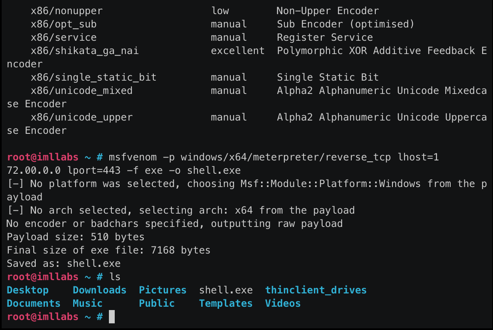

# Lab 03: Sharpening Our Keyboard Skills


Create a copy of this google document [lastname_lab03](https://docs.google.com/document/d/1klf3qsUxuvVOQ4oHkivNzW17vseHIzwvrEIch6sGgcI/edit?usp=sharing) (File > Make a Copy) to record all of your assignment answers in.

The table of contents for this lab is found below.

Part 1. Ssh ~ We're Going Places  <br>
Part 2. Introduction to Threat Hunting <br>
Part 3. Server Identification <br>
Part 4. VirusTotal <br>
Part 5. Msfvenom <br>
Part 6. Submission <br>

## Part 1 - Ssh ~ We're Going Places

The below language is simply pulled from www.immersivelabs.com for your convenience. Please, read the information below and complete the [Ssh ~ We're Going Places](https://immersivelabs.online/labs/going-places/) lab on immersivelabs.

### Secure Shell (SSH)

Secure Shell (SSH) is a network protocol which enables users to remotely log into another computer over a network connection. Unlike previous ways to achieve this, SSH provides a secure way to transfer or receive files. Not only does it encrypt the session; it also provides better authentication facilities, as well as other features which improve the security of other protocols.

The basic usage of the SSH command is as follows:

```bash
ssh USERNAME@IP/WEB ADDRESS
```

There are several options that can be used for user authentication when setting up an SSH connection. The two most common ways are with passwords and public key authentication. The basic idea behind public key authentication is to have a cryptographic key pair – a public key and private key. The public key is configured on a server to authorize access to users who have access to the private key to match. Find out more about the SSH protocol [here](https://www.ssh.com/ssh/protocol).

### Secure Copy Protocol (SCP)

Secure Copy Protocol (SCP) is a protocol which provides users with the means of copying files between hosts (local to remote and remote to remote). It uses SSH for data transfer, while using the same authentication and providing the same security as SSH.

The basic usage of the SCP command – to copy a file from the local host to a remote one – is as follows

```bash
scp SOURCEFILE USERNAME@IP/WEB ADDRESS:DIRECTORY/TARGETFILENAME
```

:interrobang: Question 1.  Submit a screenshot of your badge demonstrating the completion of this immersivelab module.

## Part 2 - Introduction to Threat Hunting

The below language is simply pulled from www.immersivelabs.com for your convenience. Please, read the information below and complete the [Introduction to Threat Hunting](https://immersivelabs.online/labs/introduction-to-threat-hunting/) lab on immersivelabs.

Threat hunting is a focused and iterative approach to seeking, identifying and understanding adversaries that have entered the defender’s networks. 

Threat hunting is a proactive task that attempts to identify unknown adversaries on a network; this is differs from incident response, which is reactive and based on an alert or security incident. Focused and funded adversaries will not be countered by security boxes on the network alone. 

Threat hunters are not simply waiting to respond to alerts or indicators of compromise (IOCs) – they are actively seeking threats to prevent or minimize damage. Sqrrl proposes that threat hunting begins with one of three hypotheses:

* intelligence driven – threat intelligence through community provided information 

* situational-awareness driven – Crown Jewel Analysis (MITRE) of trends within an organization or among its users 

* analytics driven – machine learning and behavioral trends

Threat hunters will continually collect data from across the organization, while retaining and managing it as an increasingly valuable resource. Some automation through scripting and tooling is possible, and a skilled threat hunter will know innovative ways to collect and analyse data in their hunt for anomalies. 

Automation, combined with machine learning, should assist hunters and help them prioritize their efforts. 

[The Hunter Strikes Back: The SANS 2017 Threat Hunting Survey](https://www.malwarebytes.com/pdf/white-papers/SANS_Report-The_Hunter_Strikes_Back_2017.pdf)
<br>Threat Hunting: SANS Whitepaper

[The Who, What, Where, When, Why and How of Effective Threat Hunting](https://www.sans.org/reading-room/whitepapers/analyst/who-what-where-when-effective-threat-hunting-36785)

:interrobang: Question 2.  Submit a screenshot of your badge demonstrating the completion of this immersivelab module.

## Part 3 - Server Identification

The below language is simply pulled from www.immersivelabs.com for your convenience. Please, read the information below and complete the [Server Identification](https://immersivelabs.online/labs/server-identification/) lab on immersivelabs.

> **Credentials** <br>Begin by connecting to the target server using an SSH client on port 22. Use the following credentials: <br>username: ‘root’ <br>password: ‘password’

### Honeypot servers

Honeypot servers are used to gather data about hackers, actors and attack techniques. A honeypot server presents itself as a perfectly valid, potentially vulnerable server to entice people to attack it. It then records and monitors all attacks and actions carried out against it. The data gathered can be used to profile threat actors, learn and understand emerging techniques, identify attackers, and block them.

### Testing for honeypots

To see if you are on a honeypot server, a common step is to attempt to install new software using `apt-get install`. Some honeypot servers simulate the installation of any string provided, regardless of whether it is a valid package or not.

Another useful method is to attempt to run a number of tools that you know are standard to the operating system you are using. For example, tools such as find, locate, passwd, procps, tar, and util-linux are all usually present in Linux distros but may not be installed in the honeypot.

Gain SSH access to the target in the lab, perform some enumeration of the server and determine if it is a honeypot server or not

:interrobang: Question 3.  Submit a screenshot of your badge demonstrating the completion of this immersivelab module.

## Part 4 - VirusTotal

The below language is simply pulled from www.immersivelabs.com for your convenience. Please, read the information below and complete the [PowerShell Empire](https://immersivelabs.online/labs/virustotal) lab on immersivelabs.

### Quick Summary

> A SOC Analyst should have an effective and efficient method of identifying whether files are malicious – this is vital as part of a quick triage process. There are several online services that will help you to determine if files are good or bad. One such service is virustotal.com.

VirusTotal is a public service where users can upload file samples to be scanned against various antivirus vendors. VirusTotal has over 70 antivirus scanners and URL blacklisting services that congregate results and index them to be searchable on virustotal.com. 

VirusTotal can also be used to scan domains and IP addresses. The results page for a domain search will show DNS, blacklist and WHOIS information.

### Searching

You can search for results in the VirusTotal data set using one of several queries: 

* File hash
* URL
* IP Address
* Domain Name
* Comment tags
 
### Uploading

You can upload samples to VirusTotal if there is no match to those that already exist. It is important to note that any file you upload to VirusTotal becomes public. The AV vendors and commercial customers will also be able to download any files you submit. 

These files can also be discovered as part of a search. If an advanced actor is targeting you they may also monitor VirusTotal to see if any of the malware they created appears. This behaviour would indicate that your SOC is aware of the attack vector. 

### Report

This page shows a breakdown of the scan results. If at each vendor point there was a detection, it will show the detection name for that AV. It is important to note that this detection is from a static file scan not a runtime scan. 

 ### Details

This page details static information for the file. The amount of detail depends on the file type. File hashes will be present for all samples alongside a history of when the sample has been submitted. Other details can include metadata and static analysis for exe files and DLL files. 

 ### Behavior

If the sample is of a file format that can be analysed in the VirusTotal sandbox. This page will show details generated by running the sample in a Windows virtual machine. 

### Community

The community page shows any comments and votes that have been applied to this sample. For some file types like Windows executable files, VirusTotal will run the sample in a sandbox and generate a behavior report.

### API

VirusTotal offers an API which can be used to search and submit samples in the same way that the search box does. Results are returned in standard JSON format for ease of use in scripts and third-party applications. Commercial licenses allows one to download malicious samples. There are several other options that can be used by commercial customers that are outside the scope of this lab. 

### External Links
[VirusTotal](https://www.virustotal.com/gui/home/search) <br>
The VirusTotal Home page

:interrobang: Question 4.  Submit a screenshot of your badge demonstrating the completion of this immersivelab module.


## Part 5 - Msfvenom

The below language is simply pulled from www.immersivelabs.com for your convenience. Please, read the information below and complete the [Msfvenom](https://immersivelabs.online/labs/msfvenom/) lab on immersivelabs.
Overview
msfvenom can create and encode a range of payloads across multiple languages, systems and architectures.

Generally a payload refers to a set of code(s) that a hacker designed for their specific needs. A payload can be used to carry any sets of malicious code that can hack into and/or harm another device, according to what the 'hacker' wants to achieve.

Payloads come in two main categories – staged and stageless.

Staged payloads create a small ‘dumb’ stub that is used to pull down the full payload after it is executed. This gives the benefit of a smaller initial payload but requires outbound TCP communication to complete.
Stageless payloads are larger by comparison, but they contain everything required in one payload.
Using the tool
Usage of the tool is fairly basic. In order to list available payloads, you can use the following:

```bash
msfvenom -l payloads
```

The same can be done to list the usable encoders, by replacing 'payloads' in the above example with 'encoders'.

Once the payload is selected, an optional encoder can be applied. Encoders can be used to obfuscate the payload from detection or to convert it to a specific format, such as the PHP magic_quotes encoder.

```bash
msfvenom -p [PAYLOAD/OPTION/HERE] -e [ENCODER/HERE] -f [FORMAT]
```

The next step is to apply any parameters; for example, bad characters, ports and hosts.

```bash
msfvenom -p [PAYLOAD/OPTION/HERE] -b ‘\x00’ -f [FORMAT]
```

The final stage is to select the language and file output. msfvenom can output in most common file formats and languages, e.g., exe, elf, php, asp. It can also output the raw shellcode in languages such as Python and C.




:interrobang: Question 5.  Submit a screenshot of your badge demonstrating the completion of this immersivelab module.


## Part 6. Submission

Convert your answer document in to a **.PDF** and upload a single `lastname_lab3.pdf` answer document containing all of your answers to the assignment questions to Sakai through the attachment uploads option.
