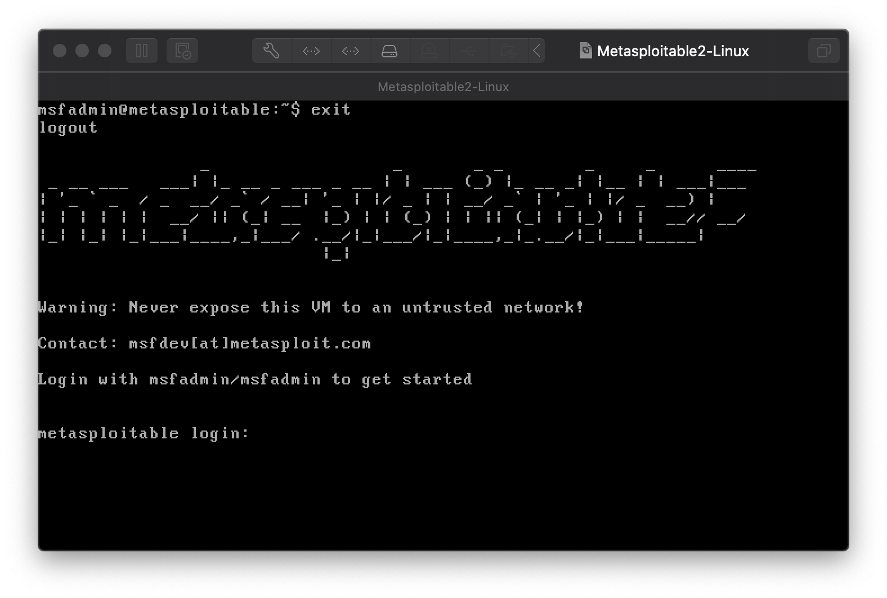

# Lab 04: Vulnerability Scanning with Nessus


Create a copy of this google document [lastname_lab04](https://docs.google.com/document/d/1l6R_C2vIcShouYYz3mCVU9Amc-wr2carv4XI6ABso1Q/edit?usp=sharing) (File > Make a Copy) to record all of your assignment answers in.

The table of contents for this lab is found below.

Part 1. Metasploitable2 Setup <br>
Part 2. Nessus Setup <br>
Part 3. Msfconsole: Exploit <br>
Part 4. Submission <br>

The key to successfully exploit or intrude a remote system is about the information you have. This week, we talked about the importance of vulnerability scanners and how pen-testers and threat actors alike will probe an organizations security posture during their active reconnaissance phase to look for any weaknesses, footholds, or vulnerabilities that they can exploit.

While it's common to use network scanners to get an idea what ports are open, the services that are in use, and to get a general idea of what an organizations network topology looks like, network scanners are *not* the same as vulnerability scanners. It's important make the distinction that nmap (a tool we used in CSF 432 to scan Metasploitable2) is not a vulnerability scanner, it's network services scanner. Nmap will only detect available network services and does not identify known vulnerabilities ~ like those that might be listed [NVD](https://nvd.nist.gov/).

Today, we're going to be scanning Metasploitable2 (an intentionally vulnerable Linux virtual machine) with Nessus (one of the most common vulnerability scanners in the cybersecurity industry). If you still have Metasploitable2 from CSF 432, great ~ you can still use that VM. If not, no worries ~ Part 1 is dedicated to get you up and running with Metasploitable2.

> :warning: The Nessus install process might take an hour or two (depending on network connectivity speed) to update itself so we have all of the most up-to-date signatures and vulnerability databases. Please be patient with this update and plan accordingly.

## Part 1 - Metasploitable2 Setup 

First, lets take a look at this labs software requirements:

#### Software Requirements

##### Download to host

* VMWare (Already installed)
* The Kali Linux - 64 bit (Already installed)
* [Metasploitable2: Vulnerable Linux Platform](http://sourceforge.net/projects/metasploitable/files/Metasploitable2/) - [file](https://drive.google.com/file/d/14XFqaqOMJ8V4r9I70mfOqjNeLnjaoNnY/view?usp=sharing)

##### Do not download to host (we'll be doing this together in our guest Kali VM)
* [Nessus](https://www.tenable.com/)

> :bangbang: :warning:  Metasploitable is an intentionally vulnerable Linux virtual machine. This VM can be used to conduct security training, test security tools, and practice common penetration testing techniques. Never expose this VM to an untrusted network (use NAT or Host-only mode if you have any questions what that means). As long as you don't change any of the networking settings on your Metasploitable Vm, you won't run into any issues.

Because the Metasploitable is already a pre-configured VM, all you need to do is open/import it into VMWare and launch it (much like the setup followed for the GNS3 VM appliance). <br>

**Step 1.1** Download [Metasploitable2: Vulnerable Linux Platform](http://sourceforge.net/projects/metasploitable/files/Metasploitable2/) - [file](https://drive.google.com/file/d/14XFqaqOMJ8V4r9I70mfOqjNeLnjaoNnY/view?usp=sharing) <br>

**Step 1.2** Unpack the compressed Metasploitable2 file you downloaded, import it in VMWare and launch it. You should see the below banner. <br>



**Step 1.3** Sign into Metasploitable using the default credentials set (username: msfadmin / pass: msfadmin)<br>

**Step 1.4** Run the below command in your Metasploitable VM:

```text
msfadmin@metasploitable:~$ ifconfig
```

:interrobang: Question 1 - Submit a screenshot of your ifconfig results.

:interrobang: Question 2 - What is the IPv4 address assigned to your metasploitable VM? Keep this handy, we'll need it for part two.

## Part 2 Nessus Setup

Ok, now it's time to set up our vulnerability scanner.

**Step 2.1** Open your Kali VM <br>

**Step 2.2** Open a browser and navigate to [https://www.tenable.com/products/nessus](https://www.tenable.com/products/nessus) <br>

**Step 2.3** Select the download button for the `Nessus essentials` package. There is no cost for this package. <br>

**Step 2.4** You'll need to enter your contact information to get access to an activation code, so complete the `Register for an Activation Code` forum. <br>

**Step 2.5** Select the blue `Download Nessus` button. <br>

**Step 2.6** Select the correct installation file for your OS. We're using Kali, so `Nessus-8.13.1-debian6_amd64.deb`.<br>

**Step 2.7** Once download, open your terminal and cd to your Nessus file location. <br>

**Step 2.8** Install Nessus Vulnerability scanned on Kali Linux using the command below. <br>

```bash
$ sudo dpkg -i Nessus-8.9.0-debian6_amd64.deb
```

**Step 2.9** After package installation, you need to start the service required for operating Nessus Vulnerability scanner. <br>

```bash
$ sudo systemctl enable nessusd
$ sudo systemctl start nessusd
```

**Step 2.10** Confirm the nessusd is actually started and running.

```bash
$ sudo systemctl status nessusd.service
```
> Nessus daemon binds to TCP port 8834.

**Step 2.11** Confirm it's running on port 8834

```bash
$ sudo  ss -ant | grep 8834
```

**Step 2.12** Visit your Nessus web interface on your server IP or hostname port 8834 to finish Nessus installation and activation. <br>

For me this is at: `https://kali:8834` <br>

**Step 2.13** On the first page, select the Nessus product to use ~ we installed Nessus Essentials so select this option.<br>

**Step 2.14** Now, you'll be prompted with another activation request form. We already did this when we downloaded our installer, so you can skip this screen.<br>

**Step 2.15** Enter the activation code that was sent to you via the email that you registered with. <br>

**Step 2.16** Use the below credentials for your Nessus account: <br>

* csf534-student (or) csf434-student
* pa55word

> For this next part, Metasploitable2 should be running. If it's not, make sure it's up and running.

You should be prompted with a `Welcome to Nessus Essentials` window.<br>

**Step 2.17** Enter the IPv4 address of your Metasploitable2 VM (reported in Part 1 Q2) and click submit. This is the host discovery phase.<br>

**Step 2.18** When your Metasploitable2 VM is detected, select the radio box and select `Run Scan`.<br>

:interrobang: Question 3 - Submit a screenshot of your vulnerability scan results. <br>

:interrobang: Question 4 - How many critical vulnerabilities were discovered?<br>

**Step 2.19** Select the `Vulnerabilities` tab.

:interrobang: Question 5 - Select a random vulnerability. What information does Nessus provide about this vulnerability? <br>

:interrobang: Question 6 - Submit a screenshot of this screen. <br>

**Step 2.20** Under `Reference Information` (bottom left), select a CVE reference link.

:interrobang: Question 7 - What is a CVE Record and what does CVE stand for? <br>

:interrobang: Question 8 - What link were you sent to? Was this the same link reported in this weeks lecture review (slide #45)<br>

## Part 3. Msfconsole: Exploit

The below language is simply pulled from [www.immersivelabs.com](www.immersivelabs.com) for your convenience. Please, read the information below and complete the [Msfconsole Exploit](https://immersivelabs.online/labs/msfconsole-exploit/) lab on immersivelabs.

#### Quick Summary

Exploitation is a key component of a full penetration test to prove a vulnerability exists and is exploitable. There are many exploits that exist for thousands of applications and versions. Metasploit comes with many of these built into its framework. In this lab you will learn how to search and use exploit modules within Metasploit.

Many applications can have vulnerabilities. Inevitably, when these are discovered, they are released either as an exploit or as proof of concept (PoC) code (in line with responsible disclosure). Metasploit has the mechanism to search and deploy these exploits with relative ease. Fortunately, a penetration tester is not restricted to writing his/her own exploits.

#### Search

After starting the msfconsole application, we can use the search command to find exploits that match a set of keywords. For example, search joomla will show all the exploits that contain the name 'joomla' in the title. 

#### Use

After finding the exploit you wish to use, you can specify Metasploit to do so by using the use command. The format for an exploit in Metasploit is as follows:

`exploit/architecture/service/exploit-type`

Once we have identified an exploit, we can interact with it by calling use with the module path. Below is an example of the command to run when you want to select an exploit to use, in this case, the Windows SMB EternalBlue exploit.

use `exploit/windows/smb/eternalblue_doublepulsar`

#### Show

The show command can be used to display all the available settings that can be applied to the exploit. Its output is verbose without a filter. To configure the exploit for use against a target, we need to set its options; the command show options will facilitate this.

In this instance, it will show elements like the Remote Host Port and IP (RPORT & RHOST) and SSL configuration. The command show payloads will list all the payloads that can be combined with this exploit. If the exploit is capable of exploiting multiple versions of operating systems, there may be individual setups for them. show targets will list these options.

#### Set

To configure and change settings for an exploit, we use the set and unset command. The first options to add will most commonly be RHOST (Remote Host), LHOST (Listener Host), Password & Username. The following command set RHOST 1.1.1.1 will set the remote host to 1.1.1.1. The set command will overwrite any existing entry with whatever you provide it. These entries can be removed by using the unset command instead of set. 

There are several options like the payload, which will not display in the show options command until after they have been set. For example, set payload linux/x86/meterpreter/reverse_tcp – if a payload has not been set, the selected module will refer to its default. set target is also used to switch between target profiles if this applies to the selected exploit.

The unset command will remove the value from an option. For example, ‘unset payload’ will clear the payload previously set and allow you to make a different selection.

#### Exploit

Once the exploit is configured with all the required options, it can be executed against the target by entering either of the following commands: exploit or run. Once the exploit has completed (and if it's successful), it will connect you to the selected payload, i.e.. a shell or Meterpreter session. If unsuccessful, it will display error messages that can be used to identify why this happened. 

:interrobang: Question 9 - Submit a screenshot of your badge demonstrating the completion of this immersivelab module.

## Part 4. Submission

Convert your answer document in to a **.PDF** and upload a single `lastname_lab4.pdf` answer document containing all of your answers to the assignment questions to Sakai through the attachment uploads option.
