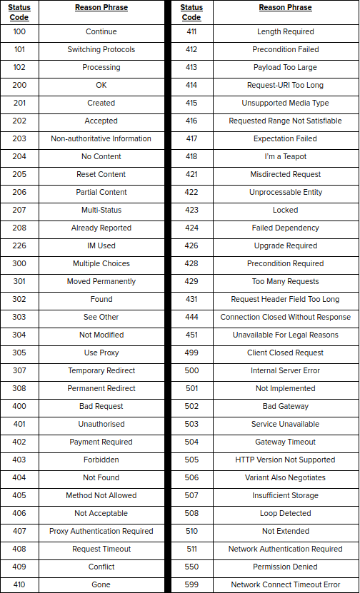

# Lab 06: Playing with Protocols

Create a copy of this google document [lastname_lab06](https://docs.google.com/document/d/1HLjd4jblOXk65STmoXEP8FVEtSEbIIQCZofs0CESfes/edit?usp=sharing) (File > Make a Copy) to record all of your assignment answers in.

The table of contents for this lab is found below.

Part 1. UDP (User Datagram Protocol) <br>
Part 2. FTP (File Transfer Protocol)<br>
Part 3. LDAP (Lightweight Directory Access Protocol)<br>
Part 4. DNS (Using Dig)<br>
Part 5. HTTP Status Codes <br>
Part 6. Submission <br>

This week, we've touched on some of the secure protocols that are used for secure communication. For this lab, we'll take a closer look at some of the protocols discussed in lecture through a practical lens. Please make sure you have completed all of the material in the lessons tab before attempting this lab.

## Part 1 - UDP (User Datagram Protocol)

The below language is simply pulled from www.immersivelabs.com for your convenience. Please, read the information below and complete the [UDP (User Datagram Protocol)](https://immersivelabs.online/labs/udp-user-datagram-protocol/) lab on immersivelabs.

#### Quick Summary

> **User Datagram Protocol (UDP)** is another transport layer protocol that determines how communication takes place over a network connection. It is used as an alternative to Transmission Control Protocol (TCP). In this lab we will introduce how UDP works, laying out the protocol's benefits and limitations.

When communicating by **UDP** the client sends a request to the server; if the server receives the request, then a response is sent to the client. Each time a **datagram** (chunk of data) is sent, the sender has no way of checking if it has reached the intended destination.

UDP lacks many of the benefits associated with TCP. However, it does make up for this by being the faster of the two protocols. This is because there is no requirement to send acknowledgement packets. Due to its speed, UDP is often used for online gaming and video streaming where many packets are normally sent in quick succession; this also means there is an allowance for the loss of some packets.

:interrobang: Question 1. Submit a screenshot of your badge demonstrating the completion of this immersivelab module.

#### Good resources on UDP

[UDP – Wiki](https://en.wikipedia.org/wiki/User_Datagram_Protocol)

[UDP – Protocol Specification](https://tools.ietf.org/html/rfc768)


## Part 2 - FTP (File Transfer Protocol)

The below language is simply pulled from www.immersivelabs.com for your convenience. Please, read the information below and complete the [FTP (File Transfer Protocol)](https://immersivelabs.online/labs/protocols-ftp/) lab on immersivelabs.

### Quick Summary

> This lab will cover the basics of File Transfer Protocol (FTP) requests. You will be given a pcap with which to analyse FTP requests.

Other than surfing the web, visiting multiple web pages, the internet is also used for downloading files (music, movies, media files, updates to operating systems). When downloading files from the internet, The file transfer protocol is used (FTP).

### How FTP works

There are two main actors involved with the FTP protocol: a server and a client. FTP exclusively uses TCP for transportation.

FTP uses port 20 for data transfer and port 21 for monitoring listening out for incoming ‘input’ commands.

The FTP ‘client’ (p20) will initiate a connection to the FTP ‘server’ (p21) and act on these modes. The server on port 21 is only used for sending commands to the client; connections to the server must always be on an ephemeral port. 

* Port 21 (sending commands) is also referred to as the command port
* Port 20 (transferring data) is also referred to as the data port

### Passive & Active Connections

#### Active

In active mode the FTP client connects from a random unprivileged port (N > 1023) to the FTP server's command port, port 21. The client is listening for active connections from Server. On the right is an example of the active mode connection from [slacksite.com](http://slacksite.com/other/ftp.html)


> Active FTP

#### Passive

Server opens and listens for a passive connection from client on port 21. 

Using passive mode, the FTP client is "reaching out" to the server to make the connection.

Firewalls generally block connections that are "initiated" from the outside. Passive mode is used to get around client firewall by opening 2 high ports (ephemeral ports above 1024) 

ASCII content of a packet represented as a command “PASV”


> Passive FTP

#### Status Codes

When in an FTP session, communication between clients and servers is represented and echoed out to the user in the form of FTP status codes. Some of these codes represent errors or the status of the connection. It is worth knowing that the communication between clients and servers are also represented this way in Wireshark. Examples of some of the codes are shown below.


* 200 Command okay.
* 212 Directory status.
* 213 File status
* 220 Service ready for new user
* 226 Closing data connection.
* 331 User name okay, need password.
* 332 Need account for login.
* 425 Cannot open data connection.
* 501 Syntax error in parameters or arguments
* 530 User not logged in.

#### FTP Transaction

Below is a simple FTP transaction where a user has logged in, selected a specific port and printed out a list of all the files in the current directory. Each step is followed with an explanation of what the user has done

`Client connects to FTP server.`

`Server returns code 220 to specify that it is ready for the new user.`

`Client sends command “USER <username>”`

`Server returns code 331 if a password is required to access the account.`

`Client sends command “PASS <password>”.`

`Server returns code 230 if authentication is successful.`

`Client sends a PORT command to specify the port number that it wants to transfer data over.`

`Server returns code 200 if the PORT command was successful.`

`Client sends a LIST command.`

`The server sends a list of files in the current directory and returns code.`

`226, which closes the connection.`

#### Basic FTP Commands

Active FTP sessions allow users to execute commands to communicate with the client & server. Commands are very similar to linux terminal commands. Below are a list of commonly used FTP commands.

* **ls** - list files in directory
* **delete** - delete files in a remote directory
* **passive** - use passive mode
* **put** - send one file
* **mput** - send multiple files
* **get** - receive file
* **mget** - receive multiple files

#### Anonymous Login

Anonymous File Transfer Protocol (FTP) allows the public to log into an FTP server with a common login (usually ‘FTP’ or ‘anonymous’) and any password (usually the person's email address) to access the files on the server.

Anonymous FTP is beneficial for the distribution of large files to the public, without having to assign large numbers of login and password combinations for FTP access.

For security purposes, Network Solutions does not support anonymous FTP.

:interrobang: Question 2. Submit a screenshot of your badge demonstrating the completion of this immersivelab module.

## Part 3. LDAP (Lightweight Directory Access Protocol)

The below language is simply pulled from www.immersivelabs.com for your convenience. Please, read the information below and complete the [LDAP (Lightweight Directory Access Protocol)](https://immersivelabs.online/labs/protocols-ldap/) lab on immersivelabs.

### Quick Summary

> LDAP is a software protocol that is commonly used on corporate intranet networks. It allows anyone on the network to locate and access organisations, individuals, and other resources, such as files and devices, whether on the public Internet or on a corporate intranet. In this lab you will go over the basics of LDAP and be tasked with analysing LDAP traffic.

#### What is LDAP

LDAP (Lightweight Directory Access Protocol) is a software protocol for enabling anyone to locate organisations, individuals and other resources, such as files and devices, in a network, whether on the public Internet or on a corporate intranet.

LDAP can be used as an optimisation layer outside a database to enhance performance, not replacing any database functions.

### The Directory Server

In a network, a directory tells you where things are located. On TCP/IP networks, the domain name system (DNS) is the directory system used to relate the domain name to a specific network address (a unique location on the network). However, you may not know the domain name. LDAP allows you to search for an individual without knowing where they're located (although additional information will help with the search).

### How does LDAP work?

LDAP is a relational database that is structured differently to MySQL, as it stores data in a more structural, user-defined way.

* LDAP looks a little bit like DNS. An LDAP directory is organised in a simple ‘tree’ hierarchy consisting of the following levels:
     * The root directory (the starting place or the source of the tree), which branches out to
     * Countries, each of which branches out to
     * Organisations, which branch out to
     * Organisational units (divisions, departments, and so forth), which branch out to (includes an entry for)
     * Individuals (which includes people, files, and shared resources such as printers)
     
LDAP consists of objects and classes. Data in LDAP is stored in objects, which will contain attributes; attributes have attribute types and options.

* Types are elements that specify how the attributes should be treated by LDAP servers. 
* Options can provide metadata about an attribute.

### Structure

LDAP servers have a ‘tree-like’ hierarchical structure. The topmost entry is the **‘root’** entry. On application, this root entry would be the organisation that owns the directory. This format then trickles down the same way: lower-level entries would make up a higher-level entry, while the structure’s leaf nodes make up **individuals or resources**.

### Entries and Attributes

LDAP consists of **objects and classes**. Data in LDAP is stored in objects, which will contain attributes. Each attribute has a name and one or more values. The names of the attributes are mnemonic strings, such as ‘cn’ for common name and **‘mail’** for email address.

An example of this would be if a company has a directory for users. All the entries in the user directory will represent a user and include such information as name and email address. 

This is represented as the following:

`cn: jimmy` <br>
`mail: jimmy@example.com`<br>
`mail: jimmyalt@example.com`<br>
`telephoneNumber: 07777077707`<br>

You will notice entries with the **dn/cn/dc** strings. These are the standard used to denote different attributes used in LDAP. It is read from right to left; where the right component is the root of the tree and the left-most component is the leaf. A few examples are shown below: 

* CN: commonName
* DC: domainComponent
* OU: organizationalUnitName
* O: organizationName
* UID: userid

[See here](https://www.manageengine.co.uk/products/ad-manager/help/csv-import-management/active-directory-ldap-attributes.html) for a list of common LDAP attributes

### Distinguished Names

**Distinguished names (DN)** refer to the name that uniquely identifies an entry in the directory. Rather than querying a single entry for common names, DNs enable users to trace back the entry to the root of the tree.

Take the following query, for example: <br>
`ou=immersive,dc=example,dc=com. `

An example DN for a user named Dave whose object is stored in the `'cn=immersive'` container in the `‘example’` domain would be:

`cn=Dave,cn=immersive,dc=example,dc=com.`

### LDAP Ports

The standard TCP ports for LDAP are 389 for unencrypted communication and 636 for LDAP over a TLS-encrypted channel.

:interrobang: Question 3. Submit a screenshot of your badge demonstrating the completion of this immersivelab module.

## Part 4. DNS (Using Dig)

The below language is simply pulled from www.immersivelabs.com for your convenience. Please, read the information below and complete the [DNS (Domain Names)](https://immersivelabs.online/labs/networking-domain-names/) lab on immersivelabs.

### Quick Summary

> Have you ever wondered how typing ‘www.immersivelabs.com’ in a web-browser directs you to our webpage? The answer is through the Domain Name System (DNS), which converts a web address to the IP address where the website is hosted. 

### Domain Name System

The **Domain Name System (DNS)** is responsible for translating the human-readable domain names we use to request websites and services into IP addresses that computers can process. 

### Local DNS cache

When you request a website using its domain name (e.g. immersivelabs.com), your computer will check its local DNS cache for any requests that have recently been made.

### Recursive DNS server

If there are no results in the local cache, a **recursive DNS server** will be queried for the domain name (immersivelabs.com). This server will normally be maintained by your Internet Service Provider (ISP) or your organisation. Other popular options for DNS resolvers include Google Public DNS and OpenDNS. 

Recursive DNS servers have their own cache that will contain results for many popular domains.

### Root name servers

If there are no cached answers for a query, the recursive DNS servers will query **root name servers**. There are 13 root name servers across the world; these are accountable for directing queries to the name servers responsible for each Top-Level Domain (TLD). In the case of immersivelabs.com, the root name server directs us to the **.com** TLD name server.

### TLD name servers

Top-Level Domains (TLD) such as .com, .co.uk and .info have their own set of name servers responsible for directing queries to the **authoritative name server** for a given domain. In our example, the TLD name server directs our query to the authoritative name server for **immersivelabs.com**. 

### Authoritative name servers

All the DNS records for a specific domain are stored by an authoritative name server. After the TLD name server directs us to the authoritative name server for immersivelabs.com, we can query it for records pertaining to immersivelabs.com. This will provide the IP address for immersivelabs.com to the web-browser. 

All of this occurs in a fraction of a second.  

### Time to live

All DNS records have a time to live (TTL) value, which stipulates how long, in seconds, a DNS answer can exist for before a recursive DNS server must request a new copy of that record.  

### Manually querying DNS with dig

DNS is a service that normally happens ‘behind the scenes’. However, it can be queried manually by the user when necessary, using tools like dig and nslookup. 

In this example, we are querying Google’s DNS (8.8.8.8) for the IP address of **immersivelabs.com**. The tool is as follows:

```bash
dig immersivelabs.com @8.8.8.8
```

### (Helpful) External Links

[DNS - Wiki](https://en.wikipedia.org/wiki/Domain_Name_System)

:interrobang: Question 4. Submit a screenshot of your badge demonstrating the completion of this immersivelab module.

## Part 5: HTTP Status Codes

The below language is simply pulled from www.immersivelabs.com for your convenience. Please, read the information below and complete the [HTTP Status Codes](https://immersivelabs.online/labs/http-status-codes/) lab on immersivelabs.

### Quick Summary

> Hypertext Transfer Protocol (HTTP) status codes indicate whether a web request has been successful and can be useful for identifying errors returned by a server. Test your knowledge by playing our mini-game, and see how many you can get correct!

### HTTP Status Codes

Hypertext Transfer Protocol (HTTP) status codes are returned by a server when requests are sent to it, indicating whether or not a request has been successful. They can also be used to identify the cause of an issue when a webpage does not load properly. 

Status codes are written in two parts: an initial status code and then a reason phrase, which provides some general information on what that code means. Reason phrases are not fixed and can be substituted for any human-readable alternative – the ones provided are merely recommendations.

Status codes are grouped into five classes:

* 1xx Informational: The request was received, the process continues.
* 2xx Successful: The request was successfully received and understood. 
* 3xx Redirection: Requires further action to complete the request.
* 4xx Client Error: The request contains bad syntax or cannot be completed.
* 5xx Server Error: The server failed to process a valid request.

The two major categories you will be familiar with are 4xx Client Error (e.g. 404 Not Found, 403 Forbidden, 400 Bad Request) and 5xx Server Error (e.g. 500 Internal Server Error, 503 Service Unavailable, 502 Bad Gateway). The three other categories do not typically alert a user, because of the nature of them not requiring an error to be addressed.

### Common HTTP Status Codes

Here is a comprehensive table of the standard HTTP status codes that exist: 



:interrobang: Question 5. Submit a screenshot of your badge demonstrating the completion of this immersivelab module.


## Part 6. Submission

Convert your answer document in to a **.PDF** and upload a single `lastname_lab6.pdf` answer document containing all of your answers to the assignment questions to Brightspace through the attachment uploads option.
