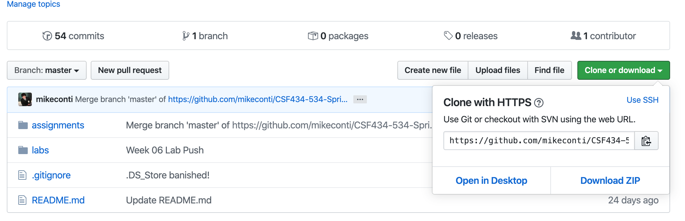
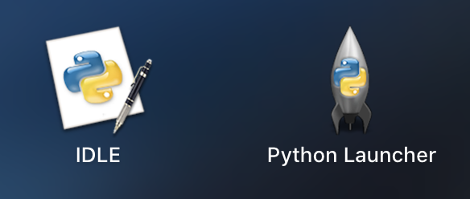
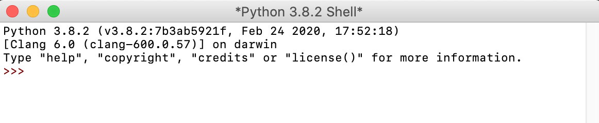
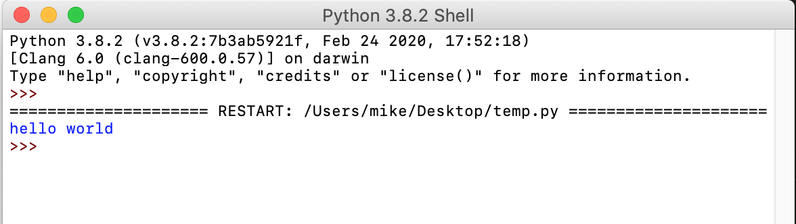
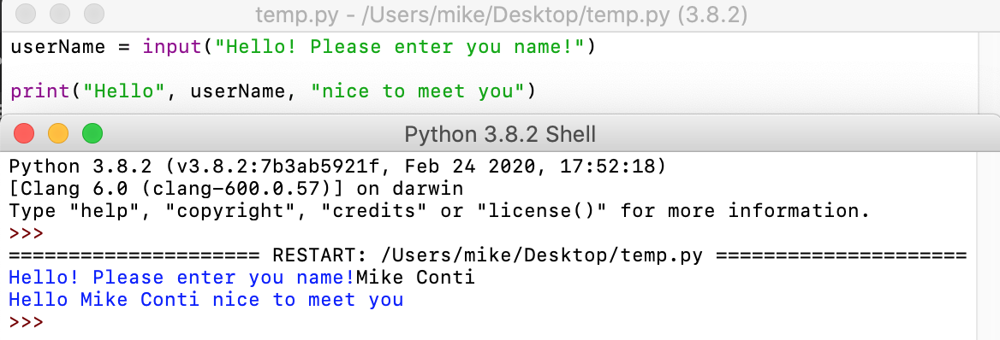
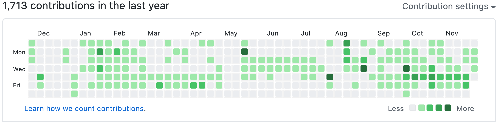
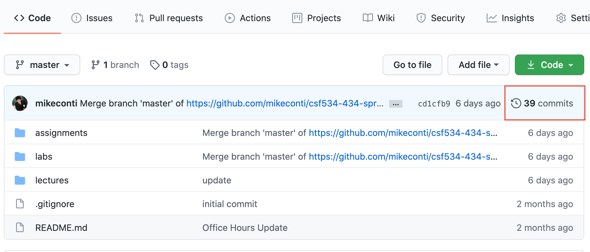
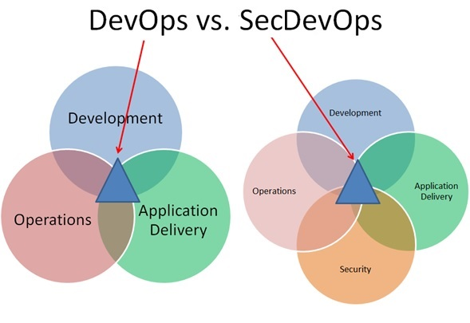
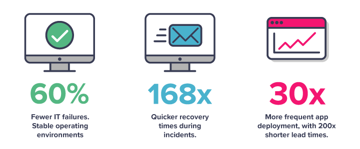

# Lab 08: Secure Programing and SecDevOps


Create a copy of this google document [lastname_lab08](https://docs.google.com/document/d/1CNf7kjRPv88wJU3yJ5AQbP_FL91fb-EkPRDU5dX8cjM/edit?usp=sharing) (File > Make a Copy) to record all of your assignment answers in.

The table of contents for this lab is found below.

Part 1. Version control with Git and GitHub <br>
Part 2. Basic input validation with Python<br>
Part 3. Using pre-defined cryptographic libraries<br>
Part 4. SecDevOps <br>
Part 5. Submission <br>

This week, we touch on a lot of important security concepts like application development, deployment, version control, code libraries (reuse), SecDevOps, and more! For this lab, we'll take a closer look at some of the concepts that we've discussed in lecture through a practical lens. Please make sure you have completed all of the material in the lessons tab before attempting this lab.

## Part 1 - Version control with Git, GitHub

For this part of the lab, you'll be making your own github repository and pushing some basic input validation python code to it.

**Step 1.1** Create a free [github](https://www.github.com/) account if you don't have one already.

**Step 1.2** Watch [this](https://www.youtube.com/watch?v=0fKg7e37bQE) video and follow the presenters instructions for downloading and creating a new GitHub repository. **You should watch the whole video, but you don't need to write any of his HTML code. You should duplicate his steps to create a new repository ~ but once he starts writing HTML you can just follow along to understand his git commands**

> Note: You'll noticed that in this video, the instructor is committing some HTML code to his repository. We'll be writing a small python program that accepts user input, will normalize that input, and check it for correctness.

**Step 1.3** Create an empty repository named **Lab08** and clone that repository to you desktop.

**Step 1.4** Open your terminal and navigate to your desktop

**Step 1.5** Run the below command:

```shell
git clone <repo link>
```

You can get your repo link by going to github.com, accessing your repo page and clicking on that green button below:



For example, if you wanted to clone our CSF 434/534 repo, you could do so by running the command 

```shell
git clone https://github.com/mikeconti/csf534-434-spring2021
```

## Part 2 - Basic input validation with Python

Now that you have an understanding of how git and GitHub work, let's write some python programs and commit our work.

 **Step 2.1** [Download Python 3.x.x](https://www.python.org/downloads/). 

**Step 2.2** Extract and install python on your machine. If successful, you should see the below icons.



**Step 2.3** Launch the IDLE or *Integrated Development and Learning Environment* and you'll notice a terminal-like shell.



This is similar to a terminal that you can execute terminal commands against, but instead of shell commands it will accept python statements. 

**Step 2.4** Create a new python file by selecting `File > New File`. You can name it helloWorld.py

Now, we have an environment where we can write full python scripts instead of single, one-line python statements.

Let's start with some basics ~ Python is a very friendly language if you've never written code before, so don't worry! Usually, the first program a programmer writes when learning a new language is the *hello world* program, where we simply execute a print statement out to our console. 

**Step 2.5** Type the below *hello world* program in your new file.

```python
print ("Hello World")
```
**Step 2.6** Save your file with `File > save` or cmd + s or ctrl + s

**Step 2.7** Run your code by selecting `run > run module` (or using the hotkey F5 (fn + F5 on Mac)). The mapping of this command might be different on a Windows machine, but it should be very similar.

If successful, you should see the results of your print out statement as shown below. 



Modify your print statement to say the below statement.

```python
print ("Hello World, my name is <your name> and I love Python!")
```

:interrobang: Question 1. Include a screenshot of your results in your answer document.

**Step 2.8** Commit and push your python code to your github repo. This should add a commit to your commit history. 

Ok, now you know how to write statements out the the console. But, how do we accept user input and store that input into a variable?

**Step 2.9** Write the below code to accept user input, store that input into a variable, and use that variable in a print out statement.

```python

userName = input ("Hello! Please enter you name!")

print ("Hello", userName, "nice to meet you")
```

:bulb: What did we just do?

The reserved keyword `input` is used when we want the user to provide some type of input to your program. Whatever the user types in gets stored in the `variable` username. Finally, we print out a welcome message using the name the user provided. Notice the words or `string` data type is always enclosed with double quotation marks? Also, we must `concatenate` the variable and strings with a comma when mixing strings and variables together.

**Step 2.10** Run your code. Your python IDLE will pop up, waiting for you to su[ply your program with input. 

**Step 2.11** Type your name into the IDLE prompt and hit enter.

:interrobang: Question 2. Provide a screenshot of the result of your input statement. I've included an example below, but instead of Mike Conti, it should be your full name.



**Step 2.12**  Commit and push your python code to your github repo.

Now, lets add a bit more complexity to this program. The motivation is to ask the user for their username and password. Once we store both of those values in two different variables, we'll normalize that input by making the username completely lowercase. 

This can be done through the use of `if statements`.

Read through the  `comments` in this code. Comments are simply statements that are not interpreted by the computer and are for human eyes only! Comments in Python are preceded with a `#` symbol.

Read through the commends and look at the code to see if you can trace what this program is doing.

```python
#Like in the above statements, all we are doing here is getting some user input and storing 
#that input in the variable userName. In this case, the users log-in name is scored in the variable.

userName = input("Hello! Please enter your facebook username! ")

#I'm doing the same thing here as in line 1, except
#the variable userPassword is storing the users password

userPassword = input("Hello! Please enter your facebook password! ")

#Here, things get a little more interesting. I'm using a conditional if-statement where I'm checking 
#the boolean expression if userName == michael resolves to true and 
#userPassword == ProgrammingRocks! is also true, then we print out Welcome to facebook!

# I the username that the user provides does not match the string 'michael' and the userPassword the 
#user provides does not match the string ProgrammingRocks!, then the user is denied entry and 
#the message wrong credentials, try again! is reported.


if(userName.lower() == "michael" and userPassword == "ProgrammingRocks!"):
    print("Welcome to facebook!")
else:
    print("Wrong credentials, try again!")


#Notice the normalization of input with the .lower() method. This method will take whatever string is provided to it,
#and make it all lowercase. So, if I were to run the command HELLO.lower() the output would be 
#`hello` in all lowercase characters

```

:interrobang: Question 3. Modify the above program to accept your first name and a password of your choice to successfully resolve the 'Welcome to facebook!' message. Provide a screenshot of the successful of your modified program in your answer document.

**Step 2.13** Commit and push your python code to your github repo.

> Why are we committing so many times? Because that's what programmers do! The more "save-spaces" we have available to us the better. Instead of writing 100 lines of code and then committing, having multiple points of history to go back to in the event of a bug or security flaw can prevent unnecessary loss of work.

## Part 3 - Using pre-defined cryptographic libraries 

Using what we learned in Part 2 about python, we'll now import a predefined cryptographic library that allows us to generate different hashes (MD5, SHA256, etc.).

In lecture, we discussed the security risk of code reuse. While using code that you have not written is risky, importing different libraries and using the predefined functions inside those libraries is an *extremely* common practice in programming.

**Step 3.1** Create a new Python file and save it as crypto.py

**Step 3.2** Import the cryptographic library we'll be using with the below line of python code:

```python
import hashlib
```

`hashlib` gives us the ability to calculate our own hashes from string data types.

We can call this library to calculate the MD5 hash of the string "hello" with the code below:

```python
import hashlib

print (hashlib.md5(b"hello").hexdigest())
```

:interrobang: Question 4. Run this file and submit a screenshot of your results.

:bulb: What did we just do?

hashlib is the library that we are calling the md5 function from `hashlib.md5()`. We are passing the string "hello" to this function (hashlib.md5(`b"hello"`)). The 'b' before the "hello" string is encoding the unicode-object "hello" to a binary format before hashing it (a condition required by this hashing function). The `hexdigest` method is returning the encoded data in hexadecimal format, which allows us to see the output hash.

**Step 3.3** Use an [online md5 hash calculator](https://emn178.github.io/online-tools/md5.html) to calculate another md5 hash of the string `hello`. 

:interrobang: Question 5. Is the md5 signature that you calculated with your python program and the one you calculated with the online tool the same? Why?

:interrobang: Question 6. Submit a screenshot of the md5 hash that you calculated using the online tool.

:interrobang: Question 7. Commit and push your python code to your github repo. 

**Step 3.4** Navigate to your github profile homepage.

:interrobang: Question 8. Submit a screenshot of your commit history graph in your answer document:



**Step 3.5** Navigate to the github repository you created in this lab.

**Step 3.6** Click on the commits history label for this repository.



:interrobang: Question 9. Submit a screenshot of your detailed commit history (include commit ID's on the right side of this page).

## Part 4 - SecDevOps

The below language is simply pulled from www.immersivelabs.com for your convenience. Please, read the information below and complete the [SecDevOps](https://immersivelabs.online/labs/secdevops/) lab on immersivelabs.

### SecDevOps

DevOps is the methodology of combining system development and IT operations to shorten system development life cycles. DevOps has allowed development to be quicker and more user-focused. 

Developing at speed can seem incompatible with the checks and balances of security and it has often been a siloed function, operating at the end of the life cycle as a go/no-go function. 

It is more important than ever that security is ‘shifted to the left’ – meaning it should be included from the very start of the process. SecDevOps embeds automated security testing into every stage of development.



### Continuous Integration and Delivery (CI/CD)

The legacy approach to software development is based on the ‘waterfall’ project management style. This involved mapping out requirements for the project, development, security and legal sign-off and then finally the deployment of a product.

This is no longer functional; the risk of losing first mover advantage is too big, so organisations have come up with 'agile' ways to rapidly release new features and iterate on them through automated development and deployment pipelines.

CI/CD is the terminology that applies to automated delivery pipelines whereby a developer can commit a small change to a codebase, and it is automatically uploaded, packaged, built, tested and deployed to live environments. Organisations running this kind of operation include Spotify, Netflix etc., and they often commit changes to their production code hundreds of times a day.

To enable a security overlay to this, we must use automated tooling and pragmatic decision making.

### Traditional IT vs Cloud Based



### The security overlay

There are several places where automated security testing can assist with injecting security into development.

### Planning

* Rapid Risk Assessment – Breaking down risk assessments into modular, rapid exercises allows businesses to address risks as they arise during the planning for a sprint or new microservice. Having developers demonstrate the proposed architecture and discuss possible security concerns will help to develop proactive thought processes in non-security-focused individuals.

* Abuse Cases – Abuse cases are design documents used to ensure that developers don’t just think about how a legitimate user may use the system but also abuse the system.

### Coding

Integrated Development Environment (IDE) – The IDE is the software application that developers write their code into. By installing plugins such as ‘findsecbugs’, code that has a security issue will be alerted to a developer’s screen as soon as it is typed.

* Repositories – code is imported into development environments from public repositories and re-used across numerous applications. While this increases the speed of development, it means that many applications share core components. If a vulnerability is discovered in one component, it can quickly affect many production applications. Security solutions can act as the gatekeeper, ensuring that dependencies and imported code are checked in case they are malicious or suffering from known vulnerabilities, triggering alerts if they are incorporated into an application.

* Build time – Prior to build, code is scanned by static analysis tools, which look for common security misconfigurations that may be present. Additionally, ensuring that code coverage tools are used (these map how much of a codebase is executed at runtime) can ensure that an attack surface is as small as possible.

* Run time – Dynamic Application Security Testing (DAST) is concerned with detection of security vulnerabilities at runtime. Using a runtime tool such as OWASP Zed Application Proxy (ZAP), businesses can insert runtime testing into the CI/CD pipeline.

:interrobang: Question 10.  Submit a screenshot of your badge demonstrating the completion of this immersivelab module

## Part 5. Submission

Convert your answer document in to a **.PDF** and upload a single `lastname_lab8.pdf` answer document containing all of your answers to the assignment questions to Brightspace through the attachment uploads option.
