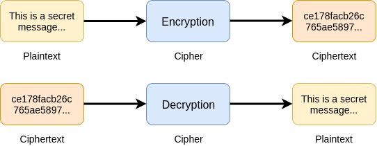
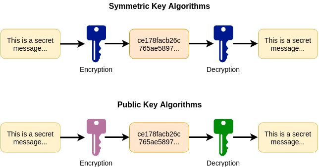
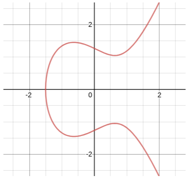
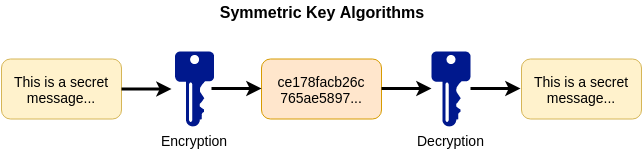
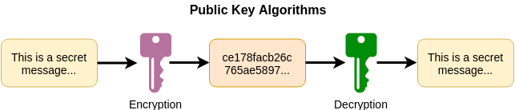

# Lab 12 - Encryption and OpenSSL

Create a copy of this google document [lastname_lab12](https://docs.google.com/document/d/1LDCoD8S45xb1abZowKCOw5pSjPuH516c_XoQ0I5q-i8/edit?usp=sharing) (File > Make a Copy) to record all of your assignment answers in.

The table of contents for this lab is found below.

Part 1. Introduction to Encryption <br>
Part 2. Symmetric vs Asymmetric Key Encryption <br>
Part 3. Caesar Cipher
Part 4. Submission <br>

## Part 1 - Introduction to Encryption

The below language is simply pulled from www.immersivelabs.com for your convenience. Please, read the information below and complete the [Introduction to Encryption
](https://immersivelabs.online/labs/introduction-to-encryption/) lab on immersive labs.

### Quick Summary

Encryption is a way of making data unreadable to anyone other than the intended recipient. Although basic encryption methods have existed for thousands of years, modern computing power means that today's encryption algorithms are much more complex. In this lab, we introduce some of the key concepts surrounding encryption, introduce common algorithms, and give you the chance to encrypt and decrypt data using a popular tool.

### What is encryption?

Encryption is the process of making information unreadable to anyone who is not supposed to have access to it. This process involves taking a piece of information, referred to as **plaintext**, and applying an encryption algorithm that produces the output, called **ciphertext**. Decryption is the reverse of this process, whereby the ciphertext is converted back to plaintext. The term cipher is often used to refer to encryption and decryption algorithms.



### Symmetric key vs public key

Encryption algorithms can be categorized as either **symmetric key** or **public key (asymmetric)** schemes. Whereas symmetric key encryption uses the same key to encrypt and decrypt a ciphertext, public key encryption uses two separate keys.



> **What is a key?** In cryptography, a key is a string of bits which can be fed into an algorithm and used to encrypt or decrypt a message.

Algorithms that use symmetric keys are typically quicker to process than those using two different keys. However, using a symmetric key algorithm introduces the problem of how to share the key securely between the sender and receiver. If the key used to encrypt a message is intercepted at any point, the ciphertext can be decrypted to get the original message.

The problem of securely sharing a symmetric key can be avoided by using different keys to carry out the encryption and decryption. By using two different keys, the encryption key can be shared with everyone, as this cannot be used to convert the ciphertext back to plaintext. This can only be achieved using the decryption key. Subsequently, these keys are often referred to as public and private keys.

### Encryption applications

Encryption algorithms are widely used to secure communications. For example, encryption is used to ensure your bank details are not visible to the rest of the internet while shopping online. It can also be used to secure the contents of your hard drive, protecting data in the event that your device is lost or stolen.

Although encryption has historically been used as a means of protecting users, in recent years attackers have been using encryption tools as a means of extorting money from victims. Many high-profile ransomware attacks have been found to use system tools that are usually used to keep data safe from malicious users.

> It is important to note that encryption does not protect users from someone intercepting the ciphertext, or eavesdropping on the communication. The aim is to make the message unreadable without a key.

### Encryption algorithms

There are a wide range of encryption algorithms used in modern computing. The following sections introduce some of the more common symmetric key and public key algorithms.


### Symmetric key

**DES**

The Data Encryption Standard (DES) is a symmetric key algorithm developed by IBM in the 1970s. With its short key length of 56 bits — DES it is not secure by today’s standards, however, it does provide the foundation for a much more secure encryption algorithm.

**3DES**

Triple DES (or 3DES) is a symmetric key cipher that applies the DES algorithm three times to each block of data. By using three 56-bit keys, the problems associated with using a single short key are mitigated. Although 3DES has been used by many applications including Microsoft Office and Mozilla Firefox, in July 2017 The National Institute of Standards and Technology (NIST) proposed to retire 3DES, suggesting AES as an alternative solution.

**AES**

The Advanced Encryption Standard (AES) was established by NIST in 2001. AES refers to three different block ciphers: AES-128, AES-192 and AES-256. The number denotes the size of the key used by each implementation. AES is considered faster and more secure than 3DES and can be used on a wide range of low-power devices.

### Public key

**RSA**

Rivest-Shamir-Adleman (RSA) is an asymmetric cryptographic algorithm that works on the basis that it is computationally expensive to find the factor of large prime numbers. The relationship between these prime numbers forms the basis of the public and private keys which are used by RSA.

**Elliptic-curve cryptography**

This type of cryptographic algorithm uses an elliptic curve, which is a specific type of curve defined by a mathematical equation. By using the properties of elliptic curves, it is easy to generate secure asymmetric keys but extremely difficult to reverse the process. An example of an elliptic curve can be seen on the graph below.



### OpenSSL

OpenSSL is an open source toolkit and general-purpose cryptography library, available across Windows, Linux, and MacOS operating systems. A wide range of algorithms have been implemented as part of OpenSSL, including all of those mentioned above. In Linux operating systems, OpenSSL can be called from the command line. The general syntax for calling OpenSSL is shown below.

`openssl command [ command_options ] [ command_arguments ]`

We have provided a number of files to encrypt and decrypt. All of the files needed for this lab are located in the Lab-Files directory, found on the Desktop. As this lab is intended as an introduction to encryption, we have provided examples of the commands needed to encrypt or decrypt each file below. Please note the -nosalt option when using AES-256. A salt is random data that is sometimes used in cryptography functions to make the output more secure. The use of salt (or salting) is not required for the purpose of this introductory lab.

**In this module**

We have provided a number of files to encrypt and decrypt. All of the files needed for this lab are located in the Lab-Files directory, found on the Desktop. As this lab is intended as an introduction to encryption, we have provided examples of the commands needed to encrypt or decrypt each file below. Please note the `-nosalt` option when using AES-256. A salt is random data that is sometimes used in cryptography functions to make the output more secure. The use of salt (or salting) is not required for the purpose of this introductory lab.

**Encrypt a file using AES-256**

`openssl enc -aes-256-cbc -a -nosalt -in [input file] -out plaintext.enc`

**Decrypt a file using AES-256**

`openssl enc -aes-256-cbc -d -nosalt -in [input file] -out [output file]`

**Decrypt a file using an RSA private key**

`openssl rsautl -decrypt -inkey [private key file] -in [input file] -out [output file]`

When running the above commands you may see a warning message explaining they are now deprecated. These warnings can be ignored for the purpose of this lab.

:interrobang: Question 1. Submit a screenshot of your badge demonstrating the completion of this immersivelab module.


## Part 2 - Symmetric vs Asymmetric Key Encryption

The below language is simply pulled from www.immersivelabs.com for your convenience. Please, read the information below and complete the [Introduction to Encryption
](https://immersivelabs.online/labs/introduction-to-encryption/) lab on immersive labs.

### Symmetric

Symmetric encryption is the simplest type of encryption, and has been used for longer than its asymmetric counterpart. A single key is used to encrypt and decrypt information. It can be a number or any string of random letters.

The key, in practice, represents a shared secret between two or more parties that can be used to maintain a private information link. Both the sender and recipient will need to know this pre-shared secret in order to decrypt any message encrypted with this method.

An example of symmetric key encryption is Advanced Encryption Standard (AES), which comes with different key sizes of 128 bits, 192 bits, or 256 bits. Other examples include RC4, DES, and 3DES.



### Asymmetric

Asymmetric encryption, also known as public key cryptography, is a newer method in which separate keys are used for encryption and decryption. These keys work in pairs and are called public and private keys. A public key is made available to anyone who wants to encrypt a message. Conversely, the private key is kept a secret and is only known by the key's initiator. This way, only the intended receiver is able to decrypt a message encrypted with its corresponding public key.

Examples of asymmetric key encryption include RSA, DSA, elliptic curve techniques, and more.



### How do they compare?

One of the main drawbacks of symmetric encryption is the fact that it uses one single key for both encryption and decryption, which is shared with all parties who wish to access the information. In this way, the separate public and private keys of asymmetric encryption make it much more secure.In addition, the two methods differ in speed. Asymmetric encryption is much slower due to the greater complexity of the two algorithms and larger key sizes. You can test this with `openssl` by using the commands:

`openssl speed rsa`

`openssl speed aes`

SSL and TLS benefit from both asymmetric and symmetric encryption. For example, a server TLS certificate contains an asymmetric public key, but the session key generated during a TLS handshake uses symmetric encryption.

### Openssl commands

Openssl is an open source toolkit and general purpose cryptography library. It will allow you to encrypt and decrypt information by utilising a range of encryption algorithms.

The following commands can be used to decrypt information in this lab.

```shell
## Symmetric
# Decrypt a file using AES-256:
openssl enc -aes-256-cbc -d -pbkdf2 -nosalt -in [input file] -out [output file]
# Decrypt a file using RC4:
openssl enc -rc4 -d -pbkdf2 -nosalt -in [input file] -out [output file]
# Decrypt a file using Triple DES:
openssl enc -des-ede-cbc -d -pbkdf2 -nosalt -in [input file] -out [output file]
## Asymmetric
# Decrypt a file using an RSA private key
openssl rsautl -decrypt -inkey [private key file] -in [input file] -out [output file]
```

In this module, your task is to practice using symmetric and asymmetric encryption to decrypt the set ciphertexts and files with three symmetric algorithms (AES, RC4, and 3DES) and one asymmetric one (RSA), as laid out in the Tasks panel. Use `openssl` for both symmetric and asymmetric algorithms, as per the above example commands. Each file is named to match the encryption algorithm used.

:interrobang: Question 2. Submit a screenshot of your badge demonstrating the completion of this immersive lab module.

## Part 3 - Caesar Cipher

The below language is simply pulled from www.immersivelabs.com for your convenience. Please, read the information below and complete the [Caesar Cipher
](https://immersivelabs.online/labs/caesar-cipher/) lab on immersive labs.

In cryptography, a **Caesar cipher** (also known as Caesar’s cipher, shift cipher, Caesar’s code or Caesar shift) is one of the oldest and most widely known encryption techniques. It is a simple substitution cipher based on a rotation of the alphabet in a specific way. Each letter in plaintext is replaced by another, located a fixed number of positions away. For example, with a left-shift of three, D would be replaced by A, E would become B and so on. So if the word **CAT** were to be encrypted with a rotation of one, the output would be **DBU**. 

### Decryption/Encryption

Mathematically speaking, the encryption process follows the equation, x = x+n, where ‘x’ represents the letter being encrypted and ‘n’ is the number of rotations. 

Caesar cipher decryption follows a similar equation; however, the number of letters shifted is subtracted rather than added. 

Encrypt: `x = x+n`
Decrypt: `x = x-n`

Another way to understand this would be through the different directions that are representative of the encryption or decryption. Simply put, when rotating left you are encrypting and when rotating right you are decrypting.

This method is named after Julius Caesar, who used it in his private correspondence. However, it is not the strongest of ciphers as it provides no communication security and can easily be solved manually. Additionally, there are many online tools that can aid in decoding Caesar ciphers such as [CyberChef](https://cyberchef.immersivelabs.online/#recipe=ROT13(true,true,13)) and [Cryptii](https://cryptii.com/pipes/caesar-cipher).

Other ciphers such as the Vigenère cipher employ the Caesar method as one element of the encryption process.

:interrobang: Question 3. Submit a screenshot of your badge demonstrating the completion of this immersive lab module.

## Part 4 - Submission

Convert your answer document into a **.PDF** and upload a single `lastname_lab12.pdf` answer document containing all of your answers to the assignment questions to Brightspace through the attachment uploads option.
